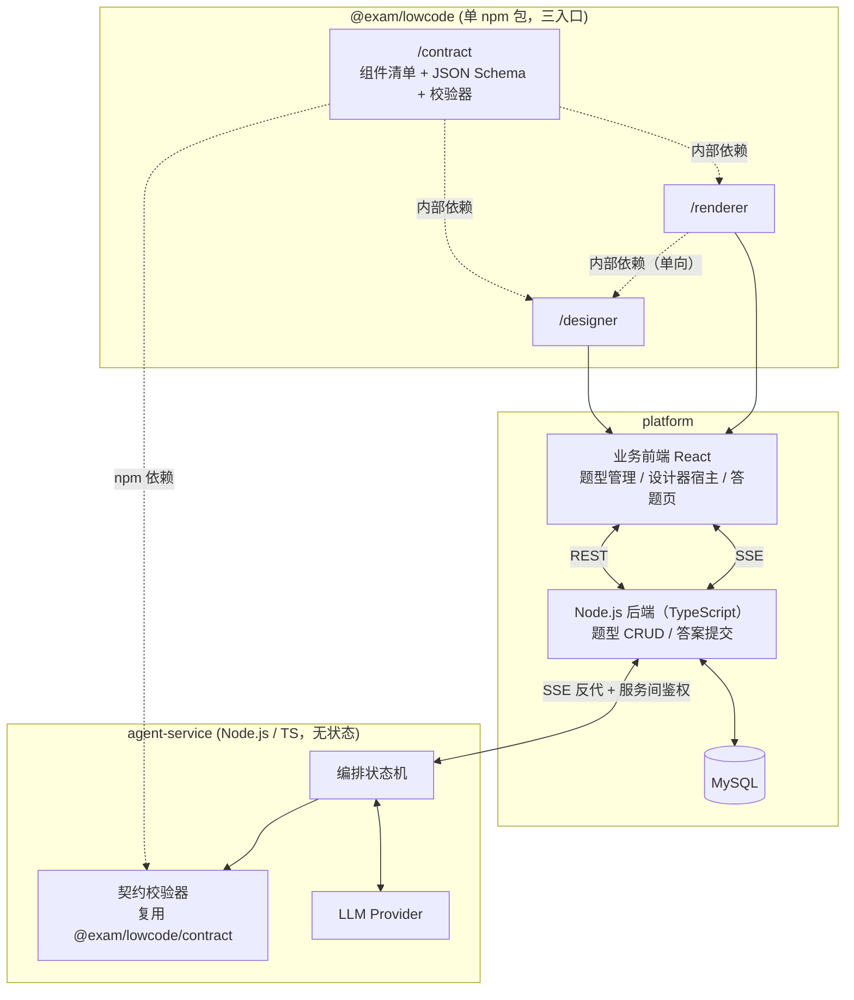
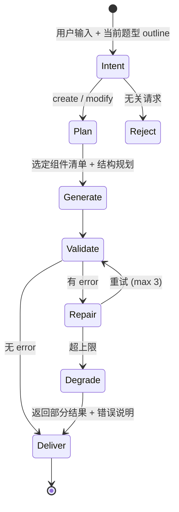

# 智能题型编排平台 设计文档
> 文档状态：v9，2026-09-11
项目定位：面向在线考试场景的题型可视化编排平台，含低码组件库与 AI 题型生成 Agent。
参考契约：`aimark-platform/designer-renderer-json-contract.md`（架构范式来源，本项目按考试场景重新收敛组件集）
>
> v9 相对 v8 的变更：**契约包发布目标切换为 GitHub Packages**。实际发布名为 `@mmverick123/lowcode`，registry 为 `https://npm.pkg.github.com/`；Agent 与 Platform 使用 npm alias `@exam/lowcode: npm:@mmverick123/lowcode@<version>`，保持现有源码 import 兼容。
>
> v7 相对 v6 的实质变更（第七轮评审，3 处校验缺口 + provider 落定）：
>
> + **补 `optionItems[].value` 唯一性 error 规则与 Agent 路径的生成归属（§5.6、§5.4.1、§8.4）**——v6 用整段论证 `value` 不可变的重要性（`correctAnswer` 与 `answer_record` 都存它），但那段纪律只写了"由 `option-editor` 自动生成"，**只覆盖人工路径**；Agent 经 `insertChild` / `updateOptions` 整体写入 `optionItems` 时 `value` 由模型产出，`option-editor` 不在链路里。且 §5.6 从无唯一性规则，两项同 `value` 能过校验、能落库，只在将来接入判分时才暴露。§8.4 的应用流程也只重整了 `id` 与 `name`。处置：加 error 规则（守住两条路径）+ 把 §8.4 改写为"三类标识符的重整"，其中 `value` 的处置与前两类**相反**——只重发新增项、既有项按 `value`（而非数组下标）判定后原样保留，并同步重写 `correctAnswer` 引用。§8.5 modify 子集早已把"`value` 是否被保留"列为断言维度，但在此之前全文没有任何一处实现保证它，**eval 断言的对象并不存在**
> + **补 `contractVersion` 缺失/格式非法的 error 规则，并把 error 分为前置检查与结构规则两段（§5.6）**——`contractVersion` 决定用哪一版 schema 校验（§7.2），它自身的合法性不可能由那一版 schema 判定，必须先于选版完成，原先的单层规则表无处安放它。同时明确校验器只判格式、不判"版本是否受支持"（后者是持有 `Map<contractVersion, ContractBundle>` 的调用方的职责，反向依赖）。连带给 Step 1 不变量 4 补上"被检对象须是完整 `QuestionJson`"的限定
> + **补 `formConfig` 不满足 `formConfigSchema` 的 error 规则（§5.6）**——`formConfigSchema` 此前只被快照测试（§10.1）与属性面板（§6.2）消费，没有任何一条校验规则读它，于是 `formConfig: {}` 与 `{ labelWidth: "宽一点" }` 都合法。补上后它与 10 个组件的 `optionsSchema` 地位完全对称，同样 `additionalProperties: false`
> + **LLM provider 落定为 Anthropic Claude，并消掉一个转换层（§8.1、§3.1、§8.3、§11 Step 4）**——结构化输出走**强制 tool use**，`input_schema` **直接吃 `optionsSchema`**。v6 计划的"`optionsSchema` → Zod → structured output"是纯绕路：`optionsSchema` 本来就是 JSON Schema，而中间那次转换会成为第二份对 schema 的解释，与 ajv 不一致时就出现"模型按 Zod 理解生成、校验器按 ajv 理解拒收"的漂移——正是 §3.1 决策 1 要消除的那类问题。Zod 降级为 `tool_use.input` 的外层形状解析守卫。另定**分阶段选模型**（Intent 用 Haiku 4.5、其余用 Sonnet 5），依据是"能被确定性规则兜住的判断才可以降配"而非"便宜就用"——Intent 判错会被 §8.2"`page` 非空即走 modify"纠回来
> + **Anthropic API 无 `seed` 参数，§8.5 的方差论证据此收紧**——原文"`temperature=0` 与 `seed` 都只是 best-effort"在 Claude 上更强：可复现性这条路根本不存在，只能靠采样次数换稳定。`eval:full` 明确每条用例跑 N ≥ 3 次并记录 N 与各次结果
> + Node.js 20 → **22 LTS**（§8.1、§11 Step 4）：Node 20 的维护期已于 2026-04-30 结束
> + Step 1 验收 fixture 由 10 份增至 13 份（三条新规则各一类）；Step 5 验收新增第 11 条（`value` 双向验证：新增项重发、既有项保留、乱序后仍保留）
>
> v6 相对 v5 的实质变更（第六轮评审，4 项 + 1 处术语澄清）：
>
> + **补全 10 个组件的完整 options 定义（新增 §5.4.1）**——此前 §5.4 只给"关键 options"，Step 1 的 registry 无法在不做二次设计的情况下开工；且 §6.2 声称样式字段是面板可配置项、§8.4 整节论证建立在"样式字段是用户有意设置的值"之上，而组件表里一个样式字段都没有，论证悬空。本次落定每个字段的类型 / default / required / `x-ui`，并定义 `x-ui` 控件集与其中唯一的跨字段依赖（`answer-select` 的 `optionsFrom`，它决定了属性面板字段渲染器的签名）。连带修正两处会踩到 Step 1 不变量 4 的定义（`image.src` 的 pattern 必须允许空串、`correctAnswer` 的"未设置"是 key 缺席而非空值），新增 `image.src` 为空的 `warn-block`，并把三处正文里硬编码的"3 条 `warn-block`"改为"全部 `warn-block` 规则"
> + **新增 `allowedChildTypes` 容器位置约束（§5.4、§5.6）**——§3.1 把"容器子节点位置约束"列为必须过程式实现的规则之一，但全文从未定义它，于是 `page` 作为后代出现、`question-group` 无限自嵌套都是合法的。更实际的问题是 Plan 阶段的清单过滤只看 `agentExcluded`，而 `page` 只标了 `internal`，根容器一直在模型的可选集里。处置：一条白名单数据同时覆盖"`page` 只能是根""不可自嵌套""树深上限 3"，且 `page` 改标 `agentExcluded: true`
> + **create 路径统一为补丁输出（§3.1 决策 3、§8.2、§8.4）**——事件分型表只有 `patch`，全量 JSON 本无承载它的事件；更严重的是非空画布上的 create 会 `setJson()` 静默覆盖用户内容，而 Intent 的判定输入里没有"画布是否为空"。统一后 Validate / diff 预览 / undo / id 重整全系统各一份实现，`page` 的 `agentExcluded` 也才成立（两处修正耦合）。代价一项：`formConfig` 无对应 op，显式定为人工专属配置
> + **`componentType` 收敛为唯一分类判别字段（§5.2、§5.6、§6.3、§7.2）**——原 `WidgetDefinition` 用 `category` / `componentType` / `formItemFlag` / `isAnswer` 四个字段编码同一个三分类，且 `category` 还被复制到每个节点实例上，逼出一条 error 规则去守这份副本与 registry 的一致性。改为单一判别字段 + 导出 `isContainer()` / `isFormItem()` 派生判定，那条规则随之删除
> + 新增 **§5.0 术语澄清**：`schema.json`（型，随包分发不入库）/ `form_json`（`QuestionJson` 实例，落库）/ `answer_data`（答案实例）三者的分工与完整数据流。澄清两点常见误读——落库的是实例不是 Schema；Renderer 渲染读实例、不读 Schema，Schema 只在 `setJson()` 的校验那一步被用到
> + Step 1 不变量断言由 4 条增至 5 条（新增"schema property 集合与 `defaultOptions` key 集合一致，例外只允许在 `designOnlyOptionKeys` 中"）；Step 3~5 验收各补 2~4 条对应新规则的检查
> + 修掉 §11 Step 3 的 v3 残留："用 fixture 验证'Go 判非法的 TS 必判非法'"——v4 已改为三仓统一 TypeScript、单一校验器实现，这条断言没有对象了
> + 修掉 §13 第 1 条的两处 v3 残留：契约"导出声明式规则"与 §5.7"声明化是未到达的升级条件"矛盾；"两侧校验器"是后端曾为 Go 时的说法，v4 起校验器只有一份
> + **富文本消毒改为三点，主防线前移到写入时（§9、§12）**——原文只写 Renderer 侧消毒，于是库里 `form_json` 存的是模型直出 HTML（§7.2 的写入过滤是 key 白名单，不碰值），任何绕过那一条渲染路径的消费方都会中招。`stem` 是 Agent 可写的自由文本，与 `image` 同属"能通过契约校验的失败"，但它不能靠 `agentExcluded` 排除——它就是题干本身。白名单由契约包导出常量，三点共用
> + 表定义补三处会让 registry 写不确定的约定：10 个组件一律 `additionalProperties: false`（未知 key 判 error 的唯一来源）；`optionItems[].value` 自动生成且创建后不可变（`correctAnswer` 与 `answer_record` 都存它，人工可改等于允许静默打穿历史答案）；per-component 表只列特有字段，公共字段不重复
> + §8.4 的 diff 文案归因修正：原文说文案由 `options.title` 生成，但 `title` 默认为空且等于默认值时会被投影剔除，实际依据是"op 类型 + 位置序号 + `displayName`"
>
> v5 相对 v4 的实质变更（修复第三轮评审的两个高优先级问题）：
>
> + **设计态挂载点下沉**（§6.1、§6.2、§6.3）——`design` 从 `QuestionRenderer` 的整树 mode 改为字段/容器组件的 mode，`renderer` 增开 `fieldComponents` / `containerComponents` 导出，Designer 画布自行递归。原设计会导致「每次拖拽都要 `setJson()` → 跑全量校验 → 设计态中间必然非法」的三重矛盾
> + **`outlineForAgent` 改为差量投影**（§8.4、§5.5）——由「按字段名单剔除样式」改为「剔除取值等于 `defaultOptions` 的可选字段」，投影从有损变为**可逆**。原设计下 Agent 看不见用户在属性面板配置的样式，无法执行样式类改写指令，且 `insertChild` 的新节点样式与兄弟节点不一致
> + 上述修正使 **modify 路径的校验闭环成立**（§8.2）：outline 本身是合法 `QuestionJson`，Agent 可在其上应用 patch 并跑同一份 `validate()`，不再把失败甩给前端 warning
> + 新增 `normalizeNode()` / `normalizeJson()`（§8.4），并明确**稀疏化只发生在发往 Agent 的出口，存储态永远是完整节点**
> + 移除未经验证的 token 数字（§8.4），卖点论证锚点由「省 token」改为「降低失败率」
> + 发布门禁的 `correctAnswer` 规则区分"未设置"（`warn-pass`）与"设置错了"（`warn-block`），并按 registry 判定适用范围（§5.6）——原规则与 §2.2「不做判分」冲突，且对 `fill-blank` / `judge` / `essay` 会误判
> + Designer 单契约版本缺口的**发作时点前移到项目自身开发周期内**，配套"Step 4~6 只增不减地演进契约"+ 版本告知条（§8.3、§11 Step 3）
> + Step 2 验收项 4 改为手工置位 `published_version`，不再依赖 Step 3 才实现的 `publish` 接口（§11 Step 2）
>
> v5 后续补充（第四轮评审，8 项）：
>
> + **接口鉴权分界补为显式的 P0 约束**（§9、§7.2、§2.2）——原文 §5.5 声称设计态入口"在 §9 的鉴权范围内"，但 §9 从未写过这条，是一条指向空处的引用。`GET /api/question-types/:id` 若匿名可访问，出口投影防线整个作废
> + **`null` 表示未作答、恒合法**（§7.2）——原规则下考生留空一道题会导致整份提交被 400
> + **`image` 的范围边界显式化**（§5.4、§9、§2.2）——仅支持外链 URL、协议限 `https:`、`agentExcluded: true`。模型编造的图片 URL 能通过契约校验，属于校验闭环覆盖不到的失败，只能靠排除组件消除
> + **「题型模板」与「题目实例」本期合一**（§2.1）——显式声明为范围决策，并写明拆分的触发条件与做法
> + `POST /api/agent/chat` 补入接口表，含 token 校验与请求体大小上限（§7.2、§9）
> + `WidgetDefinition` 补 `internal` / `agentExcluded` 两个数据化过滤标记（§5.2）
> + `formConfig` 改为同样 schema 驱动（新增 `formConfigSchema`），避免成为唯一一处手写面板（§5.2、§6.2）
> + `multi-choice` 的 `correctAnswer` 数组逐项判定（§5.6）
>
> v5 范围收缩（第五轮，2026-09-08）：
>
> + **取消 CI/CD 流水线与公网业务部署**（§2.2、§10.1）。检查项仍由 `pnpm verify` 手动执行；契约包改为正式发布到 npm registry，消费端通过精确 semver 安装，不再使用 `file:` tarball 或源码 link
> + eval 由「CI 硬门禁」改为两条手动命令 `eval:smoke` / `eval:full`（§8.5、§10.1）。`invalid-output` 与 `infra-fail` 的区分保留——该问题的本质是"用什么指标判回归"，与是否自动化无关
> + 删除 Renovate/Dependabot 自动升级链路，契约升级改为手动动作 + 升级后必跑 `eval:smoke` 的纪律要求（§10.1）
> + **新增 §11.7 工作量估算与降级顺序**。结论：Step 5/6 占 44% 工作量，全职 12~16 周；风险源不是 Step 5/6 本身，而是 Step 3 的拖拽画布（v4 的风险应对砍错了对象，见 §11.7、§12）
>
> v4 相对 v3 的实质变更：
>
> + 组件库放弃 monorepo 多包，改为单仓单包 `@exam/lowcode` + 三子路径入口（§4、§6.1）；理由是原"必须同仓"的论证支持的是同仓而非多包，且三包本就固定同步版本，独立 semver 收益为零
> + `renderer` 不依赖 `designer` 的约束改由源码级 ESLint import 边界 + 产物断言保证，不再依赖包边界（§6.1、§10.1）
> + registry 单一数据源由 `packages/designer/...` 归位至 `src/contract/registry.ts`，消除契约生成物反向依赖下游的问题（§5.2）
> + UI 依赖降为 `peerDependencies`，保证 Agent 侧安装不拉入 React/dnd-kit（§4）
>
> v3 相对 v2 的实质变更（修复第二轮评审的高/中优先级问题）：
>
> + 新增设计态字段与消费端投影（§5.5）——`correctAnswer` 不得随消费端接口下发，出口强制剥离
> + 发布门禁改为服务端实现，作为校验分层的显式强制点（§5.7、§7.2）
> + 数据模型拆 `current_version` / `published_version` 双指针，消费端只读已发布版本（§7.1）
> + Patch 协议由数字 `index` 改为 `afterId` 锚点寻址，并补齐临时 id 映射与父子偏序约束（§3.1 决策 3、§8.4）
> + 结构摘要改为"保留全部答案语义字段、只剔样式"，修正 `updateOptions` 浅合并下选项被改坏的问题（§8.4）
> + 后端按 `contractVersion` 加载对应版本契约，答案类型判定改为读 `widgets.json` 的 `answerType`（§5.2、§7.2、§10.1）
> + 契约版本迁移缺口显式声明（§2.2、§8.3）；eval 门禁区分 `invalid-output` 与 `infra-fail`（§8.5）
>
> v2 相对初版的实质变更：补丁协议改为 id 寻址（§3.1 决策 3、§8.4）；明确校验分层的强制点、残留缺口与升级条件（§5.7）；补充答案提交结构校验（§7.2）；不受支持的契约版本改为显式拒绝（§8.3）；eval 门禁改为低方差指标（§8.5）；SSE 关缓冲与取消信号传播落实到三/四层（§8.4、§10.2）；契约冻结点后移至 Step 3。
>

---

## 1. 项目定位
### 1.1 业务背景
在线考试业务中，"题型"是高频变化项：

+ 不同科目、不同考试形式需要不同的题目结构（单选、多选、判断、填空、主观题、材料分析组合题、图文混排题）。
+ 题型的定义方需求方是教研/运营人员，不是开发。传统做法是每出一种新题型就改一次前端代码并发版，交付周期长。
+ 题型一旦定义，需要同时驱动两端：考生答题页的**渲染**，以及答案的**结构化存储与判分**。

因此题型需要被抽象为**数据**而非代码。本项目的核心命题：

> 用一份版本化的 JSON 契约描述题型，Designer 负责生产，Renderer 负责消费，Agent 负责用自然语言生产。
>

### 1.2 为什么需要 Agent
教研人员使用可视化设计器仍有成本：一道"材料分析题（1 段材料 + 3 个子问，含 2 个单选 1 个主观）"手工拖拽需要十几步操作。Agent 的价值是把自然语言/已有试卷文本直接转为题型结构，人工只做审核确认。

这个场景对 Agent 是**强适配**的，原因是产出物有客观正确性标准（能否通过契约校验、能否被 Renderer 渲染），而不是开放式文本生成。这也是本项目的技术核心：**让 LLM 的非确定性输出通过确定性校验闭环收敛**。

---

## 2. 范围边界
### 2.1 本期实现
| 模块 | 范围 |
| --- | --- |
| 低码组件库 | Designer（4 面板）+ Renderer + 契约包，覆盖 10 个考试域组件 |
| 业务平台 | 题型模板 CRUD、版本管理、Designer 宿主页、Agent 聊天框宿主 |
| 消费端 | 答题页：按题型 JSON 渲染 → 考生作答 → 提交答案落库 |
| Agent 服务 | 题型生成/改写、契约校验修复闭环、SSE 流式输出、eval 集 |
| 工程化 | 契约自动生成 + 契约快照测试 + 本地构建与运行 |


**术语澄清：本期「题型模板」与「题目实例」合一。** §1.1 论证的"题型"是类别义（单选 / 多选 / 材料分析组合题），而数据模型里一条 `question_type` 记录承载的是具体题干正文与具体 `correctAnswer`，`answer_record` 也直接挂 `question_type_id`——**一条记录就是一道可作答的题**。

这是有意的合并，不是概念混淆：本期要验证的是"题型结构能否被表达为数据、能否被 Agent 生成"，把模板与实例拆开需要在契约里引入内容槽位（占位符组件 + 填充接口 + 实例表），会显著扩大范围而不增加对核心命题的验证力度。

拆分是明确的演进项，触发条件是"同一结构需要复用到多道内容不同的题"。届时的做法：契约新增 `slot` 类占位组件，`question_type` 退化为纯结构，新增 `question` 表存槽位填充值，`answer_record` 改挂 `question_id`。全文后续出现的"题型"一律指合并后的这个单位。


### 2.2 本期不做
明确排除，避免范围蔓延：

+ 组卷、考试场次、考生管理、防作弊、成绩统计
+ 自动判分（答案 JSON 落库即完成，判分逻辑不实现）
+ 权限体系（**角色与细粒度授权**不做，单用户假设。但接口鉴权本身必须做，且是 `correctAnswer` 不外泄的必要条件，分界见 §9）
+ 复杂容器：表格布局、栅格、标签页、子表单（契约保留扩展位，不实现）
+ 图片上传与文件存储（`image` 组件仅支持人工填写外链 URL，且 Agent 不生成，见 §5.4）
+ 多租户、水平扩容
+ **公网业务部署**（业务服务仅本地 Docker Compose 运行；契约包仍发布到 npm registry，见 §10.1）
+ 题型的契约版本迁移（超出支持窗口的旧题型显式拒绝而非自动升级，缺口与升级条件见 §8.3）
+ 答案提交去重/幂等（无考生身份体系，去重无可靠依据，见 §7.2）

---

## 3. 整体架构


### 3.1 关键架构决策
**决策 1：Agent 服务与业务后端物理分离，Monorepo 三工程统一 Node.js + TypeScript。**

分离理由：迭代节奏不同（prompt / 模型换代是天级的，不应触发业务后端发版）；资源模型不同（Agent 是数十秒 SSE 长连接 + 高内存，业务是短请求，混部时 Agent 流量峰值会影响业务连接池）。
代价：多一套部署与跨服务鉴权，可接受。

三工程统一 TypeScript 的收益是**校验器零漂移**：业务后端与 Agent 都直接 `import { validate } from '@exam/lowcode/contract'`，不存在第二份实现，也不需要维护跨语言 fixture 断言。具体收益三项：

+ **校验器单一实现**。JSON Schema 只能覆盖 `options` 的字段类型，覆盖不了全树 `id`/`name` 唯一性、容器子节点位置约束、`defaultValue` 与答案类型联动、`correctAnswer` 取值域等**过程式规则**。TS 全栈后这些规则只有一份，不存在"Agent/前端认为合法、后端拒收"的漂移场景。
+ **契约分发退化为包依赖**。不需要跨语言的 artifact 拉取链路，版本锚定由 npm 包管理器原生提供，多版本用 npm alias 解决。
+ **类型端到端贯通**。`QuestionJson`、`WidgetNode`、`QuestionPatch` op 类型在前端、后端、Agent 三者间同源，协议变更在编译期暴露而非运行时。

不选 Python 的理由澄清：结构化输出（Anthropic SDK 的强制 tool use，`input_schema` 直接吃契约导出的 JSON Schema，§8.1）、自写 eval 断言、自写编排状态机三项在 TS 侧均无短板。第一项在 TS 侧反而更顺：契约包导出的 `optionsSchema` 无需任何转换即可作为 tool 的 `input_schema`，换 Python 则要么重新实现一遍 schema 组装、要么把契约包的产物再序列化一次跨语言传递。真正需要 Python 的场景（本地模型推理、embedding 检索、数据集批处理）都在 §2.2 排除范围内。

**决策 2：Agent 不依赖业务后端，仅依赖契约包。**
Agent 通过包依赖获取版本化的组件定义，不调用业务后端接口拉取。这消除了反向依赖，也避免了为内部组件模型接口维护鉴权的成本（详见 §8.3）。

**决策 3：Agent 只输出增量补丁，create 与 modify 两条路径统一；补丁以 **`id`** 寻址，不使用 RFC 6902。**
改写场景下重新生成完整 `widgetList` 会导致 token 成本高、字段丢失、无法展示 diff、用户无法部分接受。

**"从零创建"也走补丁，不做全量生成的第二条通路。** 新建题型时后端已在首个版本里放好一个空 `page`（§7.2），create 就是"往空 `page` 里 `insertChild`"，与 modify 在协议上没有区别。分成两条通路会付三笔代价：

+ **SSE 事件分型缺一个出口**。事件表（§8.4）只有 `patch`，全量 JSON 没有承载它的事件；要么补一个 `document` 事件，要么承认 create 本来就该是补丁。
+ **非空画布下会静默覆盖用户内容**。用户在已有内容的设计页说"再出一道单选题"，若 Intent 判成 create → 全量 JSON → `setJson()`，画布上的既有工作直接消失，且没有任何报错。
+ **前端要维护两套应用逻辑**。语义化 diff 预览、单步 undo、`normalizeNode()` 补齐、临时 id 重整与 `name` 查重（§8.4）全是围绕补丁设计的，全量路径要么复制一遍，要么在 create 时降级为"没有预览、不能 undo"。

统一之后 §8.2 的 Validate 也只剩一条实现（把补丁应用到当前 outline，对结果跑 `validate()`），而全树生成所需的父子偏序、临时 id 引用重写，§8.4 已经全部设计好，成本为零。代价只有一项：`formConfig` 无对应 op，因此它是**人工专属配置**，Agent 不修改（见 §8.4）。

补丁格式**不采用 RFC 6902 JSON Patch**，改为以节点 `id` 寻址的自定义 op 集（`QuestionPatch`，定义见 §8.4）。原因是 RFC 6902 的数组索引寻址在本场景有三个硬伤：

+ **op 之间顺序耦合**。`remove` 与 `add` 混合时，后续 op 的索引依赖前序 op 已生效的状态，模型极易算错，且错误是静默的——改到了错误的节点而不是报错。
+ **无法语义识别**。§8.4 要求前端对"新增节点"重新生成 `id` 并做 `name` 查重改名，索引路径无法区分哪个 op 是新增，只能反向猜 value 结构。
+ **无法生成语义 diff**。"第 2 小问的选项从 4 个变成 5 个"这类预览文案，索引路径到业务语义之间没有映射。

`id` 寻址消除以上三点：`id` 全树唯一且创建后不可变（§5.3 收敛 2），op 之间顺序无关，非法 `targetId` 可被确定性拒绝。

**位置也必须用锚点表达，否则"顺序无关"只兑现了一半。** 若 op 里保留数字 `index`，同一 parent 下的 `remove` + `insertChild` 组合仍然顺序耦合——这正是上面第一条硬伤，只是范围从全树缩小到单个父节点，性质没变。因此 `insertChild` / `move` 用 `afterId`（插到该兄弟节点之后，`null` 表示队首）而非 `index`，见 §8.4。

**决策 4：不使用 Agent 框架（LangChain 等），自写编排状态机。**
本场景编排路径确定（意图判定 → 检索契约 → 生成 → 校验 → 修复），是有限状态机，几百行可控。引重型框架会掩盖重试策略、token 预算、降级逻辑等真正的设计点。仅使用 LLM 官方 SDK 的 structured output 能力。

---

## 4. Monorepo 工程划分
一个仓库内包含三个独立工程：

| 目录 | 内容 | 划分理由 |
| --- | --- | --- |
| `packages/lowcode` | Monorepo 内独立包 `@mmverick123/lowcode`，三个子路径入口 `/contract`、`/designer`、`/renderer` | 契约由组件注册表自动生成，与 Designer/Renderer 同源同版本发布；消费端仍从 GitHub Packages 安装。 |
| `apps/platform` | 业务前端 + Node.js 后端（TypeScript） | 前后端放在同一应用包，减少联调摩擦；通过目录和架构检查维持边界。 |
| `services/agent` | Node.js + TypeScript Agent 服务 | 与平台、组件库位于同一 Monorepo，但保留独立运行形态、密钥配置、质量门禁和 eval 节奏。 |


不拆成多个 Git 仓库：当前三个工程共同交付一个产品，跨仓版本协调会增加联调成本。Monorepo 只统一版本控制和工程编排，不取消组件库独立的 semver 与 npm 发布动作（§10.1）。

**lowcode 工程内部不再拆成多个 npm 包。** 上述硬约束要求的是"同源、同版本"，而非"多包"——单包的同步性更强、成本更低。三者拆成三个 npm 包只有两项独占收益，且都不成立：

+ **独立 semver**：本设计明确要求三者同步版本发布（契约变更必然连带 Designer/Renderer），即固定版本策略，独立 semver 的收益被主动放弃，只剩 changesets 联动发布的开销。
+ **答题端不含设计器代码**：这取决于打包入口与 tree-shaking，不取决于 npm 包边界。子路径 exports + 独立 build entry 即可达成（§6.1），拆包只能额外省下 `node_modules` 安装体积，对浏览器产物为零收益。

代价方面唯一真实的一项是：`services/agent` 只需要契约与校验器，但会把整包装进 `node_modules`。处置：Designer/Renderer 的 UI 依赖（React、dnd-kit 等）全部声明为 `peerDependencies`，包自身 `dependencies` 仅保留 contract 层所需（零依赖或仅 ajv），Agent 侧安装不会拉入任何 UI 依赖，仅多出未被 import 的源码文件。

`renderer` 不依赖 `designer` 这条约束因此不再由包边界保证，改由**源码层 import 边界规则**保证（`eslint-plugin-boundaries`，§6.1）。这比包边界更强：参考契约文档指出的原项目问题正是"独立性只存在于构建入口而非源码"，包边界恰恰只在构建入口生效。

`services/agent` 通过 npm registry 依赖 `@exam/lowcode` 并只 import `@exam/lowcode/contract`，与 `packages/lowcode` 之间是**发布-消费**关系而非源码耦合；不使用 workspace、相邻目录、`file:` 或 `pnpm link`。

---

## 5. 契约设计（项目基石）
### 5.0 术语澄清：三类 JSON 各归各位
全文出现的"JSON"不是一种东西，混淆它们会导致对整个架构的误读（最常见的一种是"落库的是 JSON Schema"）。三者的关系是**型 / 值 / 结果**：

| | 是什么 | 由谁生产 | 存在何处 | 谁消费 |
| --- | --- | --- | --- | --- |
| `contract/schema.json` | **JSON Schema**——描述"合法的题型 JSON 长什么样"的元数据（型） | 构建脚本从 `registry.ts` 导出（§5.2） | **随 npm 包分发，不入库** | 校验器、属性面板、Agent 的 structured output |
| `question_type_version.form_json` | **`QuestionJson` 实例**——一道题的实际结构（值） | Designer / Agent | MySQL，按版本存快照（§7.1） | Renderer、Agent、校验器的被校验对象 |
| `answer_record.answer_data` | **答案实例**——考生作答结果，key 为 `options.name` | 答题页 `getAnswerData()` | MySQL（§7.1） | 后端答案结构校验（§7.2），判分本期不做 |

因此完整链路是：

```plain
registry.ts ──构建──> schema.json（型，进 npm 包）
                          │
                          │ 校验 / 生成面板 / 约束模型输出
                          ▼
Designer ──getJson()──> QuestionJson 实例 ──POST /:id/versions──> validate() ──> form_json 落库
                                                                                     │
                                                    GET /api/exam/:code + projectForExam()
                                                                                     ▼
                                              Renderer.setJson(实例) ──递归分派──> 答题页 DOM
```

两个容易误解的点：

+ **落库的是实例，不是 Schema。** `form_json` 是一份 `{ contractVersion, widgetList, formConfig }` 数据（§5.3），Schema 只是校验它的尺子；尺子跟着契约包走版本，数据跟着题型走版本，两者由 `contract_version` 字段关联（§7.1、§7.2）。
+ **Renderer 渲染时不读 Schema。** 它读实例，按 `type` 递归分派到组件（§6.3）；Schema 只在 `setJson()` 的那一次校验里被用到。所以 Schema 的作用是"拦住非法数据"，而不是"驱动渲染"——渲染的驱动者始终是实例里的 `type` 与 `options`。

### 5.1 契约的三个消费方
同一份契约服务三个用途，这决定了它的产出形态：

+ **Designer**：组件原型（默认 options）+ 属性面板配置项
+ **Renderer**：组件分派规则 + 数据模型构建规则
+ **Agent**：组件清单（进 prompt）+ JSON Schema（进校验器）

### 5.2 单一数据源 + 自动导出
契约**不允许手写维护**，否则必然与代码漂移。唯一数据源是 `src/contract/registry.ts` 中的组件定义（**registry 住在 contract 层而非 designer 层**：契约是上游，Designer 的属性面板与 Renderer 的分派都是它的消费方，放在 designer 目录会让生成物反向依赖下游），构建脚本从中导出（§10.1）：

```plain
src/contract/registry.ts (单一源)
  ├─> contract/widgets.json      组件清单：type + displayName + 用途描述 + 适用场景
  ├─> contract/schema.json       每个 type 的 options JSON Schema + formConfigSchema
  └─> contract/version.json      contractVersion + libVersion
```

组件定义需同时携带机器可校验信息与 Agent 可理解的语义描述：

```typescript
interface WidgetDefinition {
  type: string;
  displayName: string;
  /** 供 Agent 理解用途，进 prompt 第一阶段 */
  aiHint: string;
  /** 唯一的分类判别字段，其余分类信息全部由它派生，见下 */
  componentType: 'CONTAINER' | 'DISPLAY_COMPONENT' | 'ANSWER_COMPONENT';
  /** 容器专属：允许出现在本容器 widgetList 中的子节点 type 白名单，见 §5.4 */
  allowedChildTypes?: string[];
  /** true = 引擎内部组件，不在 widget-panel 展示、不可拖拽删除（本期仅 page） */
  internal?: boolean;
  /** true = 不进 Agent 的组件清单，Agent 不得生成此类节点（本期 page 与 image，见 §5.4） */
  agentExcluded?: boolean;
  /** 答案值运行时类型，答案组件必填。Renderer 与后端答案校验共用，见 §7.2 */
  answerType?: 'string' | 'string[]' | 'boolean';
  /** 仅设计态可见的 options key，消费端下发前必须剥离，见 §5.7 */
  designOnlyOptionKeys?: string[];
  defaultOptions: Record<string, unknown>;
  /** 供校验器与属性面板共用，字段级 x-ui 控件集见 §5.4 */
  optionsSchema: JSONSchema;
}
```

**`componentType` 是唯一的分类判别字段，不设并列标记。** 参考契约用 `category` / `componentType` / `formItemFlag` / `isAnswer` 四个字段编码同一个三分类，而它们在 §5.4 中完全相关——这是四份可以互相矛盾的真相（`isAnswer: true` 配 `DISPLAY_COMPONENT` 在类型上完全合法），与本节"凡是能表达为数据的规则就不产生第二份实现"直接冲突。本项目只保留 `componentType`，其余全部派生：

```typescript
// @exam/lowcode/contract 导出的派生判定，消费方一律调用它们，不自行读标记
export const isContainer  = (t: string) => registry[t].componentType === 'CONTAINER';
export const isFormItem   = (t: string) => registry[t].componentType === 'ANSWER_COMPONENT';
export const isAnswerNode = isFormItem;   // 本期两者同义，保留别名以表达调用点意图
```

**连带影响：节点上不再存 `category`。** 参考契约把 `category: 'container'` 复制到每个节点实例上，于是 Renderer 的分派（§6.3）读的是节点副本，校验器又不得不加一条 error 规则"容器缺 `category`"去守这份副本与 registry 的一致性——用一条规则守护一个自己造出来的冗余。本项目的 `WidgetNode` 只有 `type` / `id` / `options` / `widgetList`（容器），一切分类判定读 registry，那条规则随之消失（§5.6）。

`internal`、`agentExcluded`、`allowedChildTypes` 三者都是**用数据表达的过滤/约束规则**：`widget-panel` 读 `internal` 决定展示哪些原型，Agent 的 Plan 阶段读 `agentExcluded` 裁剪组件清单，校验器读 `allowedChildTypes` 判定容器位置约束。三者都不在消费方代码里硬编码组件名单，理由同下段。注意 `internal` 与 `agentExcluded` 相互独立、不可合并：`page` 两者皆真，`image` 只有后者为真（它要在 widget-panel 里出现，只是不许模型生成）。

`componentType`、`answerType`、`designOnlyOptionKeys`、`allowedChildTypes`、以及 §5.6 中 `warn-block` 规则所需的元信息一并导出到 `contract/widgets.json`。这样后端的答案类型判定、消费端出口字段剥离、发布门禁都是**读契约数据**而非在服务代码里各维护一份常量表——凡是能表达为数据的规则就不产生第二份实现，这是 §5.7 分层能成立的前提。

**`defaultOptions` 的两条硬约束：**

+ **必须保证新建节点直接通过 error 级校验**（允许触发 warn-block）。否则"从面板拖入一个组件"这个最基本的动作会立刻产生非法草稿，Designer 无法保存。例如 `single-choice` 的 `optionItems` 默认为空数组必须是 error-free 的——这与 §6.3"空 `optionItems` 显示占位"配套。配一条单测：遍历 registry，对每个 type 用 `defaultOptions` 造节点断言 `validate()` 无 error。
+ **是 §8.4 差量投影的基准**。`outlineForAgent()` 按"取值是否等于 `defaultOptions`"决定剔除，因此 `defaultOptions` 的变更等价于契约变更，须走 §10.1 的快照测试。

### 5.3 JSON 结构
沿用参考契约的 `{ widgetList, formConfig }` 双段结构与分派规则，但做三处收敛：

**收敛 1：移除脚本字段。** 参考契约中 `formConfig.functions`、`onFormCreated`、`onFormMounted`、`onFormDataChange`、字段级 `onChange` 等以 `new Function` 执行的字段全部不引入。原因见 §9。本项目不需要在 JSON 里表达逻辑。

**收敛 2：身份字段语义严格分离。**

+ `type`：组件种类，稳定
+ `id`：节点实例 ID，创建后不可变，全树唯一
+ `options.name`：答案 key，全树唯一，匹配 `^[a-zA-Z0-9_]+$`
三者不允许相等或互相派生（参考契约中 `name` 默认等于 `id` 是历史包袱，会导致改名后答案 key 漂移）。

**收敛 3：容器子节点位置统一为 **`widgetList`**。** 不引入 `cols`/`rows`/`tabs` 多形状，避免遍历、校验、模型构建逻辑分叉。

顶层结构：

```typescript
interface QuestionJson {
  contractVersion: string;   // 新增，替代参考契约的 jsonVersion
  widgetList: WidgetNode[];
  formConfig: FormConfig;
}

interface FormConfig {
  labelPosition: 'top' | 'left';
  labelWidth: number;
  size: 'default' | 'small' | 'large';
  layoutType: 'PC' | 'H5';
}
```

### 5.4 组件集（考试域，10 个）
容器（`componentType: 'CONTAINER'`，子节点一律位于 `widgetList`，§5.3 收敛 3）：

| type | 说明 | `allowedChildTypes` |
| --- | --- | --- |
| `page` | 根容器，`internal: true` + `agentExcluded: true`，不可删除、不可嵌套 | `question-group`、`stem`、`image`、`divider`、5 个答案组件 |
| `question-group` | 组合题容器（材料 + 多个子问） | `stem`、`image`、`divider`、5 个答案组件（**不含 `page`，也不含自身**） |


**`allowedChildTypes` 是容器位置约束的唯一表达处。** §3.1 把"容器子节点位置约束"列为 JSON Schema 覆盖不了、必须由过程式规则承担的一类，但此前全文只定义了"容器/非容器的形状约束"（非容器不得带 `widgetList`），从未定义"哪些 type 可以是哪个容器的子节点"——于是 §5.6 只校验了根节点是单个 `page`，`page` 作为**后代**出现、或 `question-group` 无限自嵌套都是合法的。

改为一条白名单数据后，三件事被同时覆盖，不需要任何额外规则：

+ `page` 不出现在任何容器的白名单里 → `page` 只能是根节点
+ `question-group` 的白名单不含自身 → 不可自嵌套
+ 两者叠加使树深上限自然为 3（`page` > `question-group` > 叶子）→ 不需要显式的深度计数规则

对应的 error 规则见 §5.6；Designer 的拖拽落位命中区与 Agent 的 Plan 阶段同样读这份白名单（前者用于拒绝非法落位、后者用于告知模型层级规则），不在两侧各写一遍。

**`page` 标记 `agentExcluded: true`，模型的组件清单里没有它。** 此前 Plan 阶段的清单过滤只看 `agentExcluded`（§8.2），而 `page` 只标了 `internal`——于是根容器出现在模型的可选集里，模型完全可以在 `question-group` 里插一个 `page`，而校验器当时只管根节点。现在这条被 `allowedChildTypes` 兜住了，但更该做的是根本不把它交给模型：`page` 是引擎的结构约定，不是教研人员会用到的组件。

这一条能成立的前提是 **Agent 不再需要生成根节点**——create 路径也输出补丁而非整份 JSON（§3.1 决策 3、§8.4），新建题型时后端已经在首个版本里放好了空 `page`（§7.2），模型只需往里插内容。若 create 仍走全量生成，`page` 就必须留在清单里，两处修正是耦合的。

展示组件（`componentType: 'DISPLAY_COMPONENT'`）：

| type | 说明 |
| --- | --- |
| `stem` | 题干/材料文本，支持富文本（**写入时消毒**，见 §9） |
| `image` | 图片，**仅支持外链 URL，`agentExcluded: true`**，见下 |
| `divider` | 分割线，可带居中文字 |


**`image` 的图片来源：本期只支持人工填写外链 URL，不做上传。** 这是一处必须显式声明的范围边界，否则它是个"表里有、实际不可用"的组件。三条约束：

+ **不实现上传接口与文件存储**。图床、对象存储、本地磁盘托管都属于与题型编排正交的基础设施，做进来只会稀释项目主线。`image.options.src` 由人工在属性面板粘贴 URL
+ **`agentExcluded: true`，Agent 不得生成 **`image`** 节点**。模型没有真实图片可引用，只会编造一个幻觉 URL——而这种产出**能通过契约校验**（`src` 只要是 string 就合法），Renderer 渲染出坏图，§8.5 的结构性断言也抓不到。这是一类"校验闭环覆盖不到"的失败，只能靠把组件排除在组件清单外来消除。`aiHint` 中写明"本组件由人工配置，不可生成"
+ **URL 协议白名单 **`https:`。在 `optionsSchema` 中以 `pattern` 约束，并在 Renderer 侧二次校验。这与 §9 富文本消毒是同一类防线：`javascript:` 在 `img[src]` 上虽不执行，但 `data:` 可夹带内容、任意外链可用于追踪与防盗链绕过

一旦需要真实图片能力，升级路径是加 `POST /api/upload` + 本地磁盘存储 + `src` 改为内部路径，并移除 `agentExcluded`（此时模型可从"已上传素材清单"中选择而非编造）。

答案组件（`componentType: 'ANSWER_COMPONENT'`）：

| type | `answerType` | `designOnlyOptionKeys` | 说明 |
| --- | --- | --- | --- |
| `single-choice` | `string` | `['correctAnswer']` | 单选 |
| `multi-choice` | `string[]` | `['correctAnswer']` | 多选 |
| `judge` | `boolean` | `['correctAnswer']` | 判断 |
| `fill-blank` | `string` | `['correctAnswer']` | 单行填空 |
| `essay` | `string` | `[]` | 主观题，无标准答案 |


答案组件统一携带 `score` 与 `correctAnswer`（`essay` 无 `correctAnswer`）。判分不实现，但字段在契约中预留，否则后续演进要改契约版本。

`correctAnswer` 在 registry 中标记为 `designOnlyOptionKeys`，**不得随消费端接口下发**，处理见 §5.7。

### 5.4.1 完整 options 定义（registry 的直接输入）
以下是 10 个组件的全部 `defaultOptions` 与 `optionsSchema` 字段，**Step 1 写 registry 时逐条落地，不再有"关键 options"这种半开放列表**。此前只列关键字段有两个后果：Step 1 无法在不做二次设计的情况下开工；且 §6.2 声称"尺寸、间距、对齐同样是属性面板可配置项"、§8.4 整节论证建立在"样式字段是用户有意设置的值"之上，而组件表里一个样式字段都没有，论证悬空。

**约定**：

+ `▲` = 样式类字段（§8.4 差量投影的主要受益对象，Agent 可读可改，但从不由 Agent 主动初始化）
+ `required` 指进入 `optionsSchema.required`，受 §11 Step 1 不变量 1 保护，**永不被 `outlineForAgent()` 剔除**
+ `—` 表示该 key 不出现在 `defaultOptions` 中（"未设置"是一个与任何取值都不同的第三态，仅 `correctAnswer` 使用，由不变量 5 约束）
+ **10 个组件的 `optionsSchema` 一律 `additionalProperties: false`**。这条不是形式主义：它是"未知 key 被判 error"的唯一来源（§5.6），也是 §7.2 后端 key 白名单过滤的同源依据，同时它是 Claude strict tool use 对 `input_schema` 的要求（§8.1）——正因如此，"模型盲写一个不存在的 option"在**出口**就被挡住，而不是等到 Validate 阶段才发现。少了它，这类产出会被静默接受
+ 下列 per-component 表**只列该组件特有字段**，公共字段不重复列出：9 个非 `page` 组件均含公共字段 `title`，5 个答案组件另含表单项公共字段 `name` / `score` / `defaultValue` / `labelPosition`

**公共字段（`page` 以外的全部 9 个组件）**

| key | 类型 | default | required | `x-ui` | 说明 |
| --- | --- | --- | --- | --- | --- |
| `title` | `string` | `''` | 否 | `input` | 节点标签。答案组件上是小问标签，`question-group` 上是组标题，`divider` 上是居中文字。§8.4 的语义化 diff 文案读它 |

`page` 无任何自有 option（`defaultOptions: {}`，`optionsSchema` 为 `{ type:'object', properties:{}, additionalProperties:false }`）。表单级配置在 `formConfig`，题型名称在 `question_type.name`，都不该在根节点上再存一份。

**表单项公共字段（5 个答案组件）**

| key | 类型 | default | required | `x-ui` | 说明 |
| --- | --- | --- | --- | --- | --- |
| `name` | `string` | `<type 的下划线形式>` | **是** | `input` | 答案 key。全树唯一、`^[a-zA-Z0-9_]+$`（§5.3 收敛 2）。default 取 `single_choice` 这类占位值，拖入/应用补丁时改写为 `single_choice_1`（§6.2） |
| `score` | `number` | `0` | 否 | `number` | 分值。判分不实现，字段预留（§2.2） |
| `defaultValue` | `answerType \| null` | `null` | 否 | `hidden` | 预填答案。§6.3 取值优先级与 §5.6 的类型联动 error 规则依赖它；**本期面板不暴露，恒为 `null`**，契约保留是为后续"预填/续答"场景 |
| ▲ `labelPosition` | `'inherit' \| 'top' \| 'left'` | `'inherit'` | 否 | `radio-group` | 标签位置，`inherit` = 跟随 `formConfig.labelPosition` |

`name` 是 required 这一点不只是校验需要：它同时把这个 key 挡在差量投影之外。否则一个恰好未改名的节点（`name` 等于 default）会被剔除，Agent 就看不见自己要改的那个答案 key。

**`page`** — 无 option。

**`question-group`**（容器，+ 公共字段）

| key | 类型 | default | required | `x-ui` | 说明 |
| --- | --- | --- | --- | --- | --- |
| `showIndex` | `boolean` | `true` | 否 | `switch` | 子问是否显示序号。序号本身在渲染期按兄弟次序计算，**不作为 option 存进 JSON**（否则插入一个子问就要改写后续所有节点） |
| ▲ `gap` | `number` | `16` | 否 | `number`（4~48） | 子节点纵向间距 px |

**`stem`**（+ 公共字段）

| key | 类型 | default | required | `x-ui` | 说明 |
| --- | --- | --- | --- | --- | --- |
| `content` | `string`（HTML） | `'<p></p>'` | **是** | `richtext` | 题干正文。**写入时消毒为主防线、渲染时消毒为第二防线**，标签属性白名单由契约导出，见 §9 |
| ▲ `align` | `'left' \| 'center'` | `'left'` | 否 | `radio-group` | |

**`image`**（`agentExcluded: true`，+ 公共字段）

| key | 类型 | default | required | `x-ui` | 说明 |
| --- | --- | --- | --- | --- | --- |
| `src` | `string` | `''` | 否 | `url` | 外链 URL。schema 约束为 `^$\|^https://` —— **空串必须合法**，否则违反 §5.2"`defaultOptions` 造节点无 error"；未填写由发布门禁拦（§5.6 `warn-block`） |
| `alt` | `string` | `''` | 否 | `input` | 替代文本 |
| ▲ `width` | `number` | `100` | 否 | `number`（10~100） | 显示宽度百分比 |
| ▲ `align` | `'left' \| 'center'` | `'center'` | 否 | `radio-group` | |

`src` 的协议白名单不能写成 `pattern: '^https://'` 了事：required 与非空是两件事，若 default `''` 不满足 pattern，Step 1 的不变量 4 会立刻红。正确做法是 pattern 允许空串，"必须填"的语义交给发布门禁——这与 `correctAnswer` 的"未设置 vs 设置错了"分档（§5.6）是同一个模式。

**`divider`**（+ 公共字段，其 `title` 渲染为居中文字，空则为纯分割线）

| key | 类型 | default | required | `x-ui` | 说明 |
| --- | --- | --- | --- | --- | --- |
| ▲ `dashed` | `boolean` | `false` | 否 | `switch` | 虚线 |
| ▲ `marginY` | `number` | `12` | 否 | `number`（0~64） | 上下留白 px |

**`single-choice`** / **`multi-choice`**（+ 公共字段 + 表单项公共字段）

| key | 类型 | default | required | `x-ui` | 说明 |
| --- | --- | --- | --- | --- | --- |
| `optionItems` | `{ label: string; value: string }[]` | `[]` | 否 | `option-editor` | 选项。default 为空数组且必须 error-free（§5.2），空态由 `FieldMode: 'design'` 显示占位（§6.3）；选项数 < 2 由 `warn-block` 拦。`value` 的生成纪律见下 |
| `correctAnswer` | `string`（单选）/ `string[]`（多选） | — | 否 | `answer-select` | **designOnly**。default 不含此 key，"未设置"= key 缺席，与 `''` / `[]` 语义不同（§5.6） |
| ▲ `optionsLayout` | `'vertical' \| 'horizontal'` | `'vertical'` | 否 | `radio-group` | 选项排列方向 |

**`optionItems[].value` 由 `option-editor` 自动生成（nanoid 短串），创建后不可变，面板不提供编辑入口；`label` 可任意改。** 这条纪律与节点 `id` 同源（§5.3 收敛 2），必须显式写下来，否则 §8.4 的整段论证与已落库的答案数据都会被打穿：

+ `correctAnswer` 与 `answer_record.answer_data` 存的都是 `value`。允许人工改 `value`，等于允许一次改名把历史答案全部对不上，而且没有任何报错——和 §5.3 拒绝"`name` 默认等于 `id`"是同一类问题
+ §8.4 论证"不能只保留 `optionItems` 的 label"时说的是"模型没见过 value 就会重新编造 value，把现有选项的标识改坏"。若 `value` 本就是人工可改的自由字符串，这个风险不止来自模型
+ 反过来，`value` 不可变使"把 B 选项的文案改一下"成为纯 `label` 修改，`correctAnswer` 与历史答案自动保持正确

`option-editor` 因此有三个动作：增（生成新 `value`）、删（若被 `correctAnswer` 引用则提示）、拖序（只换数组次序，`value` 不动）。

**但上述纪律只覆盖了人工生产路径，Agent 路径必须另行约束。** `optionItems` 是整体写入的（`insertChild` 的新节点自带、`updateOptions` 浅合并时整数组替换，§8.4），这两条路径上的 `value` 都由模型产出，`option-editor` 根本不在链路里。后果有两层：

+ **模型可能产出重复 `value`**（"A"/"A"/"B"/"C" 这类），而 `optionsSchema` 只约束数组元素的形状，判不了元素间的唯一性。这条由 §5.6 新增的 error 规则承担，落在校验器上——它同时守住人工与 Agent 两条路径，而不是在 Agent 侧单写一份检查
+ **模型新造的 `value` 不能直接入库**。与节点 `id` 同理：模型编的标识符一律由前端在应用补丁时重发，规则见 §8.4"三类标识符的重整"。这里的关键是**重发范围必须精确到"新增的那几项"**——把整个数组的 `value` 都重发会打穿已落库答案，正是本节开头要防的那件事

因此 `value` 的完整生成归属是：**人工新增走 `option-editor`，Agent 新增走 §8.4 的重整流程，两者都产出 nanoid 短串，此后不可变。** 模型在 outline 里看到的既有 `value` 是只读上下文，它复述回来的既有项必须原样保留（§8.5 modify 子集为此设了断言维度）。

**`judge`**（+ 公共字段 + 表单项公共字段）

| key | 类型 | default | required | `x-ui` | 说明 |
| --- | --- | --- | --- | --- | --- |
| `trueLabel` | `string` | `'正确'` | 否 | `input` | |
| `falseLabel` | `string` | `'错误'` | 否 | `input` | |
| `correctAnswer` | `boolean` | — | 否 | `radio-group` | **designOnly**，未设置 = key 缺席 |
| ▲ `optionsLayout` | `'vertical' \| 'horizontal'` | `'horizontal'` | 否 | `radio-group` | |

**`fill-blank`**（+ 公共字段 + 表单项公共字段）

| key | 类型 | default | required | `x-ui` | 说明 |
| --- | --- | --- | --- | --- | --- |
| `maxLength` | `number` | `200` | 否 | `number`（1~1000） | **后端答案校验据此拦截超长**（§7.2） |
| `placeholder` | `string` | `''` | 否 | `input` | |
| `correctAnswer` | `string` | — | 否 | `input` | **designOnly**。无 `optionItems`，故 §5.6 的取值域规则自动跳过 |
| ▲ `width` | `number` | `240` | 否 | `number`（80~600） | 输入框宽度 px |

**`essay`**（+ 公共字段 + 表单项公共字段）

| key | 类型 | default | required | `x-ui` | 说明 |
| --- | --- | --- | --- | --- | --- |
| `minLength` | `number` | `0` | 否 | `number`（0~1000） | **仅前端提示，后端不据此拒绝**，见下 |
| `maxLength` | `number` | `2000` | 否 | `number`（1~10000） | 后端据此拦截超长（§7.2） |
| `placeholder` | `string` | `''` | 否 | `input` | |
| ▲ `rows` | `number` | `6` | 否 | `number`（2~20） | 文本域行数 |

`minLength` 只能是前端提示，不能成为服务端拒收条件：§7.2 规定 `null` 表示未作答且恒合法、本期契约没有"必答"概念，若后端按 `minLength` 拦，一个 `minLength: 50` 的主观题就变成了隐式必答项，留空提交会被 400——正是 §7.2 花一整段避免的那个故障。

**`formConfig` 的 `formConfigSchema`（§6.2，同样 schema 驱动）**

| key | 类型 | default | `x-ui` |
| --- | --- | --- | --- |
| `labelPosition` | `'top' \| 'left'` | `'top'` | `radio-group` |
| `labelWidth` | `number` | `100` | `number`（60~300） |
| `size` | `'default' \| 'small' \| 'large'` | `'default'` | `select` |
| `layoutType` | `'PC' \| 'H5'` | `'PC'` | `radio-group` |

**`x-ui` 控件集（属性面板的全部控件，新增组件只允许复用其中之一）**

```typescript
type XUi =
  | { widget: 'input' }
  | { widget: 'textarea'; rows?: number }
  | { widget: 'richtext' }                    // 编辑器粘贴入口同样走消毒路径（§9）
  | { widget: 'number'; min?: number; max?: number; step?: number }
  | { widget: 'switch' }
  | { widget: 'select';      options: { label: string; value: string }[] }
  | { widget: 'radio-group'; options: { label: string; value: string }[] }
  | { widget: 'url' }                         // input + 协议提示，校验仍由 optionsSchema 承担
  | { widget: 'option-editor' }               // optionItems 专用：增删 / 拖序 / label+value 双列
  | { widget: 'answer-select'; optionsFrom: string; multiple?: boolean }
  | { widget: 'hidden' };                     // 在契约中存在但面板不暴露（defaultValue）
```

**`answer-select` 是面板里唯一的跨字段依赖，它决定了字段渲染器的签名。** `correctAnswer` 的取值域不是一个静态枚举，而是同节点 `optionItems` 的实时投影（`optionsFrom: 'optionItems'`）。因此属性面板的字段渲染签名必须是 `(value, allOptions, node) => ReactNode` 而非 `(value) => ReactNode`——只拿当前字段值的写法无法渲染这个控件，等实现到 `single-choice` 时再改就要动整个面板。`judge` 的 `correctAnswer` 取值域固定（`trueLabel`/`falseLabel` 只改显示文案不改取值），故用普通 `radio-group`。

> `x-ui` 与复合结构编辑器的需求正是 §11 Step 1 说明中"会反推 schema 调整"的那部分，**所以契约冻结点仍在 Step 3 验收之后**（§12）。本表是开工基线而非冻结版本：Step 1~3 期间可以增删字段，但每一次变更都要同步更新本表，不允许出现"代码里有、表里没有"的字段。
### 5.5 设计态字段与消费端投影
`correctAnswer` 是答案，`options` 又是随题型 JSON 整体下发的。若消费端接口原样返回 `form_json`，考生打开答题页看一眼网络请求即可拿到全部正确答案——这是一条比 XSS 更直接的业务安全缺陷，且不会有任何报错提示。

因此契约必须区分**设计态 JSON**与**消费态 JSON**：

+ **设计态 JSON**（库中 `form_json` 原文）：字段完整，仅经 Designer / Agent / 版本接口流转。**这三条出路必须全部要求用户 token**，鉴权分界见 §9——出口投影只护住 `/api/exam/:code` 一条路径，设计态接口若匿名可访问，本节的整套防线作废
+ **消费态 JSON**：由契约包导出的 `projectForExam(json)` 生成，按 registry 的 `designOnlyOptionKeys` 递归剥离每个节点的设计态 key（本期为 `correctAnswer`；`score` 保留，答题页需展示分值）

三条硬性约束：

+ **剥离必须发生在服务端出口**，即 `GET /api/exam/:code` 的响应构造处。放到前端等于没做。后端按 `widgets.json` 的 `designOnlyOptionKeys` 做 key 删除，属于"读数据"而非重复实现规则（§5.2）。
+ **校验器必须容忍 **`correctAnswer`** 缺失**：消费态 JSON 仍要能通过 Renderer 的 `setJson()` 校验，故 `correctAnswer` 在 `optionsSchema` 中不可为 required，其"取值须在 `optionItems` 内"的规则归入 `warn-block`（§5.6）而非 error。这条约束与发布门禁配套：完整性由发布时把关，运行时校验不依赖它。
+ **新增答案组件时必须评估设计态字段**：任何带"标准答案""解析""评分细则"语义的新 option，都必须进 `designOnlyOptionKeys`。这一点写入契约包的 registry 注释与 PR checklist。

**契约包共有两个出口投影，形状对称、纪律一致：**

| 函数 | 剥离对象 | 性质 | 出口 |
| --- | --- | --- | --- |
| `projectForExam(json)` | 设计态字段（本期为 `correctAnswer`） | **有损**，故意的 | `GET /api/exam/:code` |
| `outlineForAgent(json)` | 取值等于 `defaultOptions` 的可选字段 | **无损**（可逆，见 §8.4） | 发往 agent-service |

两者遵循同一条纪律：**投影只发生在出口，存储态永远是完整节点。** 库中 `form_json` 始终是 normalize 后的完整 JSON——若把投影结果入库，将来修改 `defaultOptions` 会使历史题型的实际渲染跟着变，且没有任何版本记录能解释这个变化。

### 5.6 校验规则（校验器与 Agent 闭环共用）
按严重级别分层，Agent 修复循环只针对 error：

**error（阻断）**

error 规则分两段：**前置检查**不依赖 registry，在选定 schema 之前执行；**结构规则**在选定 schema 之后遍历全树。这个次序不是排版问题——`contractVersion` 决定用哪一版 schema 校验（§7.2），它自身的合法性不可能由那一版 schema 判定，必须先于选版完成。

*前置检查（`validate()` 的第一段，零 registry 依赖）*

+ **缺 `contractVersion`，或不匹配 `^\d+\.\d+\.\d+$`**
+ 顶层缺 `widgetList` 数组或 `formConfig` 对象

*结构规则（遍历全树 + 顶层）*

+ 节点 `type` 未在注册表中
+ `id` 缺失或全树重复
+ 非容器节点带 `widgetList`（容器判定读 registry 的 `componentType`，节点上不存 `category`，见 §5.2）
+ **节点 `type` 不在其父容器的 `allowedChildTypes` 内**（§5.4）
+ 答案组件缺 `options.name`，或 `name` 全树重复 / 不匹配命名规则
+ `options` 不满足该 `type` 的 `optionsSchema`
+ **同一节点内 `optionItems[].value` 重复**（§5.4.1，仅对声明了 `optionItems` 的组件生效）
+ `defaultValue` 类型与答案类型不符（如 `multi-choice` 的默认值非数组）
+ 根节点非单个 `page`
+ **`formConfig` 不满足 `formConfigSchema`**

结构规则第 3、4 条替换了原先的"容器缺 `category: 'container'`"：分类判定统一读 registry 后，节点与 registry 之间不再有可能不一致的副本，那条规则失去了对象（§5.2）。第 4 条是位置约束，它顺带覆盖了"`page` 作为后代出现"与"`question-group` 自嵌套"两种此前合法的畸形树（§5.4）。

**关于 `contractVersion`：校验器只判"格式合法"，不判"版本受支持"。** 后者是调用方的职责——后端与 Agent 各自持有 `Map<contractVersion, ContractBundle>`（§7.2、§8.3），取不到对应 bundle 时返回各自的拒绝语义（HTTP 4xx / `UNSUPPORTED_CONTRACT_VERSION`）。把"受支持版本清单"塞进校验器等于让契约包知道它的每一个消费方装了哪些版本，方向是反的。

**关于 `optionItems[].value` 唯一性：这条是 §5.4.1 那段不可变纪律的强制点。** `correctAnswer` 与 `answer_record.answer_data` 都以 `value` 为标识，两个选项共用一个 `value` 时"选中了哪一项"在数据层面不可区分，而这种题能正常渲染、能提交、能落库，只在将来接入判分时才暴露。§5.4.1 的纪律只约束了 `option-editor` 这一条生产路径，Agent 经 `insertChild` / `updateOptions` 整体写入 `optionItems` 时 `value` 由模型产出，纪律管不到——**规则必须落在校验器上，生成侧的重整规则见 §8.4**。

**关于 `formConfig`：`formConfigSchema` 此前只被快照测试（§10.1）与属性面板（§6.2）消费，没有任何一条校验规则读它**，于是 `formConfig: {}` 或 `{ labelWidth: "宽一点" }` 都能通过校验。补上这条后 `formConfigSchema` 与 10 个组件的 `optionsSchema` 地位完全对称，同样 `additionalProperties: false`，也同样是 §7.2 后端 key 白名单过滤的同源依据。

**`formConfigSchema` 的 4 个字段全部 `required`**，与 §5.3 中 `FormConfig` 四个字段皆非可选的 TS 定义对齐（`formConfig: {}` 因此判 error）。这与节点 `options` 大量字段可选并不冲突：节点的可选字段靠 `normalizeNode()` 打底、靠差量投影剔除（§8.4），而 `formConfig` 既无 per-node normalize、又被 `outlineForAgent()` 整体保留，没有任何一处会替它补齐缺失的键——它只能自己保证完整。

**warning（不阻断持久化，回显给用户）**

warning 分两档，区别在于是否阻断**发布**（`POST /:id/publish`）：

| 级别 | 规则 | 适用范围 | 是否阻断发布 |
| --- | --- | --- | --- |
| `warn-block` | 题型中无任何答案组件 | 全局 | 是 |
| `warn-block` | 选项数 < 2 | `optionItems` 为已声明 option 的组件（`single-choice` / `multi-choice`） | 是 |
| `warn-block` | `correctAnswer` **已设置**但取值不在 `optionItems` 内 | 同上，且 `correctAnswer !== undefined`。`multi-choice` 的 `correctAnswer` 是数组，规则**逐项判定**，任一项越界即触发 | 是 |
| `warn-block` | `src` 为空串 | `image` 节点 | 是 |
| `warn-pass` | `correctAnswer` 未设置 | 所有声明了 `correctAnswer` 的答案组件 | 否 |
| `warn-pass` | 总分为 0 | 全局 | 否 |


`image` 那条与 `correctAnswer` 是同一个模式：schema 层必须允许空值（否则 `defaultOptions` 造出的节点直接非法，违反 §5.2 与 Step 1 不变量 4），"必须填"的语义只能由发布门禁承担。**注意本表的 `warn-block` 条数不是常量**——§5.7、§7.2、§11 Step 3 一律表述为"全部 `warn-block` 规则"，不写具体条数，否则每加一条规则就要同步改三处正文，而漏改不会有任何征兆。


理由：草稿态允许结构不完整（正在编辑中），但一个不含答案组件、或选项不足两个的题型发布到消费端没有意义。分数未配置属于运营信息缺失，不影响答题可用性，故不阻断。

**`correctAnswer` 相关规则必须区分"未设置"与"设置错了"，否则会与 §2.2"本期不做判分"直接冲突。** 若把 `undefined` 也判为"不在取值范围内"，等于强制每道题配好标准答案才允许发布——而判分并不实现，这个门禁拦的是一个本期不存在的用途。语义定为：

+ **未设置**（`undefined`）→ `warn-pass`。契约中 `correctAnswer` 非 required（§5.5），未配置是合法状态，回显提醒即可
+ **已设置但非法**（取值不在 `optionItems` 内）→ `warn-block`。这是确凿的配置错误，且一旦将来接入判分会直接判错，必须拦

**规则的适用范围由 registry 数据判定，不在校验器里硬编码组件名单。** 上表第 2、3 条只对"`optionsSchema` 中声明了 `optionItems`"的组件生效——本期是 `single-choice` / `multi-choice`。`fill-blank` / `judge` 有 `correctAnswer` 但无 `optionItems`（取值域由 `answerType` 而非枚举约束），`essay` 两者皆无，三者均自动跳过这两条，无需特判。这与 §5.2"凡是能表达为数据的规则就不产生第二份实现"一致：规则本身是过程式 TS 代码（§5.7），但它的**适用范围**是读 registry 得出的。

`warn-block` 是**服务端门禁**，不是前端提示，实现归属见 §5.7。

### 5.7 校验的实现归属
校验器实现落在 `@exam/lowcode/contract` 中，**唯一一份**，由 Designer、Renderer、Agent、以及业务后端四方直接 import 复用。其中 schema 可表达的字段级规则由 `schema.json` 驱动，过程式规则（唯一性、结构约束、类型联动、取值域）以 TS 代码实现。

业务后端与组件库同为 TypeScript，直接 `import { validate, validateForPublish } from '@exam/lowcode/contract'`，不存在第二份实现，也不存在跨语言规则漂移的风险。

**完整语义校验的四个强制点，全部来自同一份实现：**

+ Designer store 装载：`setJson()` / `applyPatch()` 调用校验器
+ Renderer `setJson()`：整树装载、渲染前校验
+ Agent 的 Validate 状态：生成后校验、修复循环（modify 路径作用于 outline，见 §8.2）
+ 业务后端写入路径：`POST /:id/versions` 持久化前校验，`POST /:id/publish` 执行发布门禁（error 全量 + 全部 `warn-block` 规则）

**强制点的触发时机是"整树装载"与"外部输入"，不是"每次变更"。** Designer 画布的拖拽落位、属性面板改值属于内部增量命令，不跑全树校验——设计态中间状态本就允许不完整（§5.6），每次变更都跑校验既有性能问题，也会产生大量无意义的报错。设计器的 `validate()` 是显式 API（工具栏、保存前）与防抖后台校验，结果只用于回显，不阻断编辑。

**触发升级的条件**（当前均未到达）：一旦出现需要在 JS 运行时之外执行校验的场景（如 Go 语言的微服务接管写入），才需要把过程式规则声明化（导出 `rules.json`，各侧实现解释器）。本期所有写入路径均经 Node.js 后端，无此需求。


---

## 6. 低码组件库设计
### 6.1 包结构与内部边界
单包 `@exam/lowcode`，三个子路径入口：

```plain
src/
  contract/    registry.ts（单一数据源）+ 生成的 schema/类型 + 校验器 + 投影/归一函数，零 UI 依赖
  renderer/    依赖 contract，导出 <QuestionRenderer /> + fieldComponents + containerComponents
  designer/    依赖 contract + renderer，导出 <QuestionDesigner />
package.json exports:
  "./contract"  → dist/contract.js   （Agent / 后端消费）
  "./renderer"  → dist/renderer.js   （答题页消费）
  "./designer"  → dist/designer.js   （设计页消费）
```

三条约束及其保证手段：

| 约束 | 保证手段 |
| --- | --- |
| `renderer` 不 import `designer` | ESLint `boundaries/element-types`，违反即 lint 失败 |
| `contract` 不 import `renderer`/`designer`，且不引入任何 UI 依赖 | 同上 + `contract.js` 产物做依赖快照断言（bundle 内不得出现 react） |
| 答题页产物不含设计器代码 | 独立 build entry + `sideEffects: false`；构建后断言 renderer 产物体积与 bundle 内不含 designer 模块标识（§10.1） |


`renderer` **不依赖 **`designer`。参考契约文档 §3 指出原项目 Renderer 反向导入了 Designer 目录下的字段组件，导致独立性只存在于构建入口而非源码。本项目修正：字段组件的**渲染态实现**放在 `renderer`，`designer` 通过组合方式包裹（加拖拽边框、选中态、落位指示器）复用，依赖方向单向。**注意包边界本身无法防住这个问题**（原项目也是分包的），真正的防线是上表第一行的源码级 import 规则。

**为保证这个依赖方向不在实现期崩塌，设计态行为必须由 **`renderer`** 层的字段组件承担，而非由 Designer 另写一套变体。** Designer 需要的能力包括：禁用交互但保持完整视觉、`optionItems` 为空时显示占位而不是渲染成空白、点击不触发答题而是冒泡给外层选中逻辑。如果这些能力不在 `renderer` 内提供，实现时最省力的做法就是在 Designer 里另写一套字段组件变体或反向 import，依赖方向立刻失效。

**但挂载点是字段组件，不是整树 **`QuestionRenderer`。 若把 `design` 做成 `QuestionRenderer` 的 mode，Designer 画布就得整树走 `QuestionRenderer`，而 §6.3 规定 Renderer 不 watch `json` 深度变化、宿主必须调 `setJson()`，`setJson()` 又是 §5.7 的强制校验点——于是每一次拖拽都要重新装载 + 跑全量校验，而设计态中间状态本就允许不完整。这三者互相矛盾，无解。

因此 `renderer` 导出三样东西，`design` 只出现在后两者的 mode 上：

```typescript
export { QuestionRenderer };        // 整树，mode: RenderMode（不接受 design）
export { fieldComponents };         // Record<type, FC<FieldProps>>
export { containerComponents };     // Record<type, FC<ContainerProps>>，slot 式

type RenderMode = 'answer' | 'readonly' | 'preview';
type FieldMode  = RenderMode | 'design';

interface FieldProps     { node: WidgetNode; mode: FieldMode; value: unknown; onChange?: (v: unknown) => void }
interface ContainerProps { node: WidgetNode; mode: FieldMode; children: React.ReactNode }
```

类型系统本身即边界：`QuestionRenderer` 的 mode 类型不含 `design`，编译期就杜绝了"整树设计态"这种用法。容器组件设计为 slot 式——**容器自身的视觉归 **`renderer`**，容器里放什么归调用方**：答题页放渲染后的子节点，Designer 放"子节点 + 落位指示器"。这条规则不设例外，一旦允许 Designer 自己画容器壳，"所有渲染视觉归 renderer"就会被逐步侵蚀。

这样答题页 `import { QuestionRenderer } from '@exam/lowcode/renderer'` 的浏览器产物不含设计器代码；Agent 侧 `import ... from '@exam/lowcode/contract'` 不引入任何 UI 依赖（UI 依赖为 `peerDependencies`，见 §4）。

### 6.2 Designer 结构
四区布局：

| 区域 | 组件 | 职责 |
| --- | --- | --- |
| 左侧 | `widget-panel` | 按容器/展示/答案分组展示可拖拽组件原型 |
| 中间 | `form-widget` | 画布，递归渲染节点，处理拖拽落位、选中、复制、删除 |
| 右侧 | `setting-panel` | 按选中节点 `type` 从 `optionsSchema` 动态生成属性表单；**未选中节点时展示 `formConfig` 表单** |
| 顶部 | `toolbar-panel` | 撤销/重做、预览、导入/导出 JSON、清空、保存 |


**`formConfig` 也走 schema 驱动，不手写面板。** 画布空白处点击 = 取消选中 = `setting-panel` 切到表单级配置（`labelPosition` / `labelWidth` / `size` / `layoutType`，§5.3）。为此 registry 需额外导出一份 `formConfigSchema`（同样带 `x-ui`），与组件的 `optionsSchema` 共用同一套控件渲染逻辑。否则 `formConfig` 会成为唯一一处手写面板，"新增配置项只需改 registry 一处"这条就有了例外。`formConfigSchema` 一并进 `contract/schema.json`，并同样受 §10.1 的快照测试约束。


**设计点：画布自行递归，复用 **`renderer`** 的字段与容器组件。** `form-widget` 递归遍历树，对每个节点：容器节点渲染 `containerComponents[type]`，children 为「递归后的子节点 + 落位指示器」；叶子节点渲染 `fieldComponents[type]` 且 `mode="design"`；两者外层统一包一层 Designer 自己的 chrome（拖拽把手、选中边框、hover 态、删除/复制按钮）。

画布**完全不经过 **`QuestionRenderer`，因此不涉及 `setJson()`，也就不会每次拖拽都跑全量校验（§5.7）。递归由 Designer 掌控也是必需的：落位指示器的插入点、拖拽命中区、框选都需要在遍历过程中织入，交给整树 Renderer 反而要往里塞一堆 Designer 专用的 ref 转发与回调。

**设计点：属性面板由 schema 驱动生成，不为每个组件手写配置面板。** `optionsSchema` 中通过 `x-ui` 扩展声明控件类型，控件集是**封闭的 11 项**（§5.4.1），新增组件只允许复用其中之一，不允许为某个组件新写一个控件——否则"新增组件只需改 registry 一处"立刻有例外。字段渲染器的签名必须是 `(value, allOptions, node) => ReactNode`，因为 `answer-select` 需要读同节点的 `optionItems`（§5.4.1 的跨字段依赖），只拿当前字段值的写法在实现到 `single-choice` 时就得推翻重做。样式类字段（尺寸、间距、对齐）同样是属性面板的可配置项，因此它们是**用户有意设置的值**——这一点决定了 §8.4 的 outline 不能按字段名单剔除样式。

状态管理：设计器内核为独立 store（zustand），暴露命令式 API：

| API | 行为 |
| --- | --- |
| `getJson()` | 深拷贝返回 `QuestionJson` |
| `setJson(json)` | 校验后加载，记录历史 |
| `applyPatch(patch)` | 应用 `QuestionPatch`（id + `afterId` 锚点寻址），记录历史为**单个**history entry（Agent 入口，整次改动可一步 undo） |
| `validate()` | 返回 error/warning 列表 |
| `undo()` / `redo()` | 历史栈，上限 30 步 |


拖拽新增节点时：深拷贝 `defaultOptions` → 生成 `id`（nanoid）→ **仅答案组件**生成不冲突的 `options.name`（default 的 `type` 下划线形式 + 序号，如 `single_choice_1`，§5.4.1）→ 校验落位是否在目标容器的 `allowedChildTypes` 内（§5.4），不满足则命中区不亮、不产生节点。深拷贝要求契约值必须 JSON 可序列化，不得含 `Function`/`Date`/`undefined`。

`name` 只存在于答案组件（它是答案 key，§5.6 也只对答案组件强制），展示组件与容器不带这个 key，因此不需要为它们做查重。**registry 里也不存"仅面板展示用"的字段**——`displayName` / `aiHint` 属于 `WidgetDefinition` 而非 `defaultOptions`（§5.2），节点上不会出现需要事后删除的残留，这也是 Step 1 不变量 5 要守住的形状。

**store 内部持有的始终是 normalize 后的完整节点**（`defaultOptions` 已展开）。属性面板要显示每个字段的当前值，稀疏节点会让面板无从取值；`getJson()` 的产出直接入库，也必须是完整节点（§5.5）。稀疏化只发生在发往 Agent 的出口（§8.4）。

### 6.3 Renderer 结构
`QuestionRenderer`（整树）输入：

| Prop | 用途 |
| --- | --- |
| `json` | 题型定义 |
| `answerData` | 外部传入的已有答案（回显/续答） |
| `mode` | `RenderMode` = `answer` \| `readonly` \| `preview`（**不含 **`design`） |
| `onChange` | 答案变化回调 |


整树三态语义：

| mode | 交互 | 用途 |
| --- | --- | --- |
| `answer` | 可作答 | 考生答题 |
| `readonly` | 只读、有值回显 | 查看已提交答案 |
| `preview` | 可作答但不提交 | 设计器预览 |


字段/容器组件的 `FieldMode` 在上述三态之外多一个 `design`：

| mode | 行为 | 用途 |
| --- | --- | --- |
| `design` | 输入控件禁用但保持完整视觉、点击事件不消费（冒泡给宿主选中逻辑）、空 `optionItems` 显示占位而非空白 | Designer 画布逐节点渲染，见 §6.1、§6.2 |


**`design` 只存在于字段/容器组件层，不存在于整树层。** 由 `renderer` 提供而非 Designer 自写变体，是为了保证 §6.1 的单向依赖在实现期不被绕过；不放在 `QuestionRenderer` 上，是为了避免"画布每次变更都要 `setJson()` + 全量校验"（理由见 §6.1）。

分派规则（简化自参考契约 §5.2，去掉 `grid` 特例）：

```plain
isContainer(node.type) ? `${node.type}-item` : `${node.type}-widget`
```

**分派判定读 registry 而非节点上的字段。** 参考契约写的是 `node.category === 'container'`，即每个节点实例都带一份分类副本；本项目的分类唯一存放于 registry（§5.2），`isContainer()` 由契约包导出。收益是节点与 registry 不可能不一致，`WidgetNode` 也随之瘦身为 `type` / `id` / `options` / `widgetList`。

答案模型构建：递归遍历，`isFormItem(node.type)` 为真的节点以 `options.name` 为 key。取值优先级：`answerData[name]` > `options.defaultValue` > `null`。`question-group` 不产生自身 key，其子答案平铺到顶层（组合题的子问答案独立可判分）。

暴露方法：`getAnswerData()`、`validate()`、`setJson()`、`reset()`。

**明确语义：Renderer 不 watch **`json`** 深度变化**，宿主切换题型必须调 `setJson()`。参考契约文档 P1 提到这一点未被文档化，本项目在 README 中固化，并在内部对传入 prop 做深拷贝，避免修改宿主状态。

---

## 7. 业务平台设计
### 7.1 数据模型
```sql
-- 题型模板
CREATE TABLE question_type (
  id            BIGINT PRIMARY KEY AUTO_INCREMENT,
  code          VARCHAR(64)  NOT NULL UNIQUE COMMENT '题型编码',
  name          VARCHAR(128) NOT NULL,
  description   VARCHAR(512) NOT NULL DEFAULT '',
  subject       VARCHAR(32)  NOT NULL DEFAULT '' COMMENT '学科',
  status        TINYINT      NOT NULL DEFAULT 0 COMMENT '0从未发布 1已发布 2已归档',
  current_version   INT      NOT NULL DEFAULT 0 COMMENT '最新草稿版本，设计器读它',
  published_version INT      NOT NULL DEFAULT 0 COMMENT '当前对外生效版本，0=未发布；消费端只读它',
  created_at    DATETIME     NOT NULL,
  updated_at    DATETIME     NOT NULL,
  INDEX idx_status_subject (status, subject)
);

-- 题型版本快照（JSON 与元数据在此，题型表只存指针）
CREATE TABLE question_type_version (
  id                BIGINT PRIMARY KEY AUTO_INCREMENT,
  question_type_id  BIGINT       NOT NULL,
  version           INT          NOT NULL,
  form_json         JSON         NOT NULL,
  contract_version  VARCHAR(32)  NOT NULL COMMENT '生成该 JSON 的契约版本',
  lib_version       VARCHAR(32)  NOT NULL COMMENT '组件库 npm 版本',
  source            TINYINT      NOT NULL COMMENT '0人工 1Agent生成 2Agent改写',
  created_at        DATETIME     NOT NULL,
  UNIQUE KEY uk_type_version (question_type_id, version)
);

-- 答题记录（消费端产出）
CREATE TABLE answer_record (
  id                BIGINT PRIMARY KEY AUTO_INCREMENT,
  question_type_id  BIGINT       NOT NULL,
  version           INT          NOT NULL COMMENT '作答时的题型版本，保证可复现',
  examinee          VARCHAR(64)  NOT NULL DEFAULT 'anonymous',
  answer_data       JSON         NOT NULL,
  submitted_at      DATETIME     NOT NULL,
  INDEX idx_type (question_type_id, version)
);
```

**设计点：版本快照独立表，答题记录锚定版本号。** 题型模板会持续迭代，若答案只关联 `question_type_id`，题型改动后历史答案的结构含义就丢失，无法回溯渲染。这与 §8.3 的契约版本化是同一个问题的两个层面。

**设计点：**`current_version`** 与 **`published_version`** 必须是两个独立指针。** 只有一个 `current_version` 会产生一个静默故障：题型发布后继续编辑并保存，`current_version` 前进到新草稿，而消费端接口若读 `current_version`，**未经发布门禁的草稿就直接暴露给考生**——错误不会报警，只会表现为考生看到半成品题目。

因此状态语义定义如下：

+ `current_version`：每次 `POST /:id/versions` 递增，设计器与版本历史读它
+ `published_version`：仅在 `POST /:id/publish` 成功时写入（值取当次发布的版本号），`GET /api/exam/:code` **只读它**，为 0 则该 code 对外不可访问（404）
+ `status` 只表达生命周期（从未发布 / 已发布 / 已归档），不表达"有无未发布草稿"。后者由 `current_version > published_version` 派生，前端据此在设计页展示"有未发布改动"，不新增字段
+ 发布是显式动作：已发布题型继续编辑不会自动生效，也不会撤销线上版本。这同时给了"改坏了但没发布"的安全空间
+ 发布指定版本而非固定发布最新版：`publish` 请求体带 `version`，允许回滚到历史版本（把 `published_version` 指回旧版），实现成本为零，收益是有回滚手段

`contract_version` + `lib_version` 双记录，落实参考契约文档 §7 的建议：单一 `jsonVersion` 不足以区分持续演进的组件 options。

**版本号生成必须依赖数据库约束，不能靠"读 **`current_version`** + 1"。** 后者在并发下会撞 `uk_type_version`——即使单用户，开两个标签页同时保存就会触发。实现方式：在事务内 `SELECT ... FOR UPDATE` 锁住 `question_type` 行，取 `current_version + 1` 插入版本表并回写指针；捕获唯一键冲突后重试一次。

**演进项（本期不做）：** 若需要"刷新页面后 Agent 对话不丢"，加一张 `agent_conversation`（`question_type_id` / `session_id` / `role` / `content` / `patch_json` / `created_at`），由平台后端持久化。对话历史归属业务侧而非 Agent 侧，Agent 保持无状态，理由见 §8.4。

### 7.2 后端接口
Node.js + TypeScript + Fastify，分层 `handler / service / repository`，ORM 使用 Prisma（MySQL）。

| Method | Path | 说明 |
| --- | --- | --- |
| GET | `/api/question-types` | 列表，支持 status/subject/keyword 分页筛选 |
| POST | `/api/question-types` | 创建题型。**同时创建首个版本，`widgetList` 为单个空 `page` 节点**（`code` 由后端 nanoid 生成，§9） |
| GET | `/api/question-types/:id` | 详情，返回 `current_version` 的 JSON（设计态，字段完整） |
| PUT | `/api/question-types/:id` | 更新元信息 |
| POST | `/api/question-types/:id/versions` | 保存新版本快照 |
| GET | `/api/question-types/:id/versions` | 版本列表 |
| GET | `/api/question-types/:id/versions/:v` | 指定版本 JSON（设计态） |
| POST | `/api/question-types/:id/publish` | 发布指定 `version`（服务端跑 error + `warn-block` 门禁，见 §5.7），成功后写 `published_version` |
| DELETE | `/api/question-types/:id` | 归档（软删），同时清零 `published_version` 使 code 对外失效 |
| GET | `/api/exam/:code` | 消费端：取 `published_version` 快照的**消费态 JSON**，响应体带 `version` |
| POST | `/api/exam/:code/answers` | 消费端：提交答案，请求体带 `version` + `answerData`，须通过答案结构校验 |
| POST | `/api/agent/chat` | Agent SSE 反代（§9、§10.2）：校验用户 token → 限制请求体大小 → 注入服务间凭证 → `reply.raw` 直通转发至 `agent-service:3000/agent/chat` |


**鉴权分界（必须，见 §9）：** 上表以 `/api/exam/*` 开头的两个接口**匿名可访问**，其余全部**要求用户 token**。这条分界不是运营配置而是安全边界——`GET /api/question-types/:id` 返回的是设计态 JSON（含 `correctAnswer`），若它可匿名访问，§5.5 的出口投影防线整个失效。

**`/api/agent/chat` 的请求体大小上限（必须）：** `questionOutline` 由前端生成并原样转发给 Agent（§8.4），若不设上限，任何能调用该接口的一方都可以任意放大 Agent 的输入 token，直接产生真实费用。§8.5 给 eval 写死了 token 上限，运行时入口同样需要——上限在这一层就要拦，不能只依赖 Agent 侧的会话计数器。


**首个版本必须是"含空 `page` 的合法 JSON"，不能是 `null` 或空数组。** 三处依赖这一点：Designer 打开新题型时 `setJson()` 需要一份能过校验的 JSON（`widgetList: []` 违反"根节点非单个 `page`"）；Agent 的 create 路径是往这个 `page` 里 `insertChild`（§3.1 决策 3），没有它就没有 `parentId`；`page` 因此也无需进 Agent 的组件清单（§5.4）。`page` 的 `id` 由后端生成，此后不可变（§5.3 收敛 2）。

**消费端出口投影（必须）：** `GET /api/exam/:code` 的响应必须经 §5.5 的字段剥离——按 `widgets.json` 的 `designOnlyOptionKeys` 递归删除每个节点的设计态 key（当前即 `correctAnswer`）。这不是可选的优化项：漏掉这一步等于把标准答案发给考生，且没有任何报错。三项配套约束：

+ 剥离在 handler 返回前统一执行，不由前端承担
+ 剥离后的 JSON 必须仍能通过 Renderer 的 `setJson()` 校验（§5.5 已保证 `correctAnswer` 非 required）
+ Step 2 验收含一条断言：`GET /api/exam/:code` 响应全文不含 `correctAnswer` 字符串

**服务端校验（必须）：** 写入 `form_json` 前后端直接 `import { validate } from '@exam/lowcode/contract'` 执行完整语义校验，与 Designer/Renderer/Agent 共用同一份实现，见 §5.7。

**后端必须按 JSON 声明的契约版本加载对应 schema。** 库中并存多个 `contract_version` 的快照（改写旧题型、回滚历史版本都会读到旧 JSON），若统一用最新校验器校验，旧 JSON 会被误拒、新字段会被漏检。实现方式：后端启动时按 `package.json` 中声明的受支持版本（主版本 + npm alias 历史版本，见 §8.3），构建 `Map<contractVersion, ContractBundle>`；**取不到对应版本则拒绝该请求**，与 §8.3 的"宁可不可用，不要不正确"保持一致，不回落到最新版。版本锚定与完整性校验由 npm 包管理器原生提供，无需额外的 artifact 仓库或启动时 HTTP 拉取。

同时执行**脚本字段剥离**：即使契约不含脚本字段，仍按白名单过滤未知 key，防止上游注入。

**发布门禁（必须）：** `POST /:id/publish` 执行 error 全量 + 全部 `warn-block` 规则，任一不通过则拒绝发布，不写 `published_version`。所需组件元信息读 `widgets.json`，不在服务侧硬编码。

**答案提交校验（必须）：** `POST /api/exam/:code/answers` 是全系统唯一由匿名外部输入直接写库的接口，且没有可信前端可依赖。不能把 `answer_data` 原样落 JSON。校验项：

+ 请求体大小上限
+ 请求声明的 `version` 必须存在且属于该 `code`（否则考生可探测任意版本）
+ `answer_data` 的 key 必须是该题型该版本中 `isFormItem(type)` 为真的节点的 `options.name` 集合的子集（未知 key 直接拒绝，不是忽略）
+ 每个**非 **`null`** 值**的类型必须匹配对应答案组件的 `answerType`
+ 字符串长度受 `options.maxLength` 约束

**`null` 表示未作答，恒合法；类型校验只对非 `null` 值执行。** 这条不能省：§6.3 规定 `getAnswerData()` 对未作答字段返回 `null` 且该 key 仍出现在结果对象里，若类型校验把 `null` 判为"不匹配 `string`"，**考生只要留空一道题，整份提交就会被 400 拒绝**——而这是最常见的提交路径。本期契约也没有 `required` / 必答的概念，所有答案字段都可为空，因此全 `null` 的空卷同样必须被接受。（前端另一种做法是提交前剔除 `null` 键，由于 key 集合是子集判定，这条路径也合法；两种都要能过。）

**类型判定读契约数据，不在服务侧维护映射表。** 答案类型来自 `widgets.json` 的 `answerType`（§5.2），后端只做 `type → answerType → 值类型断言` 的通用判定。这样契约新增答案组件时后端零改动，消除了"人工同步映射表"这条必然漂移的路径——凡是能表达为数据的规则就不产生第二份实现。

**校验依据必须是请求中声明的 **`version`** 对应的快照，而不是 **`published_version`——否则题型发布新版后，正在答题的考生提交会被判为非法。`version` 由 `GET /api/exam/:code` 的响应下发，前端原样回传。

**答案提交不做幂等约束**：同一 examinee 对同一题型版本可重复提交，每次新增一条 `answer_record`。本期无考生身份体系（§2.2），去重没有可靠依据，故不做。

### 7.3 前端页面
React + TypeScript + Vite + Ant Design。

| 路由 | 页面 | 说明 |
| --- | --- | --- |
| `/question-types` | 题型列表 | 表格 + 筛选 + 新建/编辑/发布/归档 |
| `/question-types/:id/design` | 设计页 | `@exam/lowcode/designer` 宿主 + 右侧 Agent 聊天抽屉 + 版本历史 |
| `/exam/:code` | 答题页（消费端） | `@exam/lowcode/renderer` 宿主，`mode=answer`，提交答案 |
| `/exam/:code/preview` | 预览 | `mode=preview` |


设计页承载 Agent 交互，是本项目的主界面（详见 §8.4）。

---

## 8. Agent 服务设计
### 8.1 技术栈
| 项 | 选型 | 说明 |
| --- | --- | --- |
| 运行时 | Node.js 22 LTS + TypeScript | 与组件库对齐，复用契约包与校验器 |
| HTTP 框架 | Fastify | 原生流式响应支持好，schema 校验内建，开销低于 Express |
| LLM provider | **Anthropic Claude** | 官方 TS SDK `@anthropic-ai/sdk`，不引 Agent 框架 |
| 模型 | **Sonnet 5**（Plan / Generate / Repair）+ **Haiku 4.5**（Intent） | 分阶段选型，理由见下 |
| 结构化输出 | **强制 tool use**，`input_schema` 直接吃 `optionsSchema` | **不经 Zod 转换**，理由见下 |
| 契约 | `@exam/lowcode/contract`（npm 依赖） | 组件清单、JSON Schema、校验器、TS 类型 |
| 会话状态 | 进程内 `lru-cache`（TTL 2h） | 服务无状态化，不引入 Redis，理由见 §8.4 |
| 测试 / eval | Vitest | 单测与 eval 结构性断言共用 |


不引入 Agent 编排框架的理由见 §3.1 决策 4。

**结构化输出走强制 tool use，`optionsSchema` 直接作为 `input_schema`。** 定义一个工具（如 `emit_patch`），把 `QuestionPatch` 的 JSON Schema 连同 Plan 阶段选中的那几个 `optionsSchema` 组装为它的 `input_schema`，再以 `tool_choice: { type: 'tool', name: 'emit_patch' }` 强制模型走这条出口。模型返回的是 `tool_use` 块而非自由文本，不需要在 prompt 里写"只返回 JSON"，也不需要从 markdown 代码块里抠 JSON。

**这条选型消掉了原计划中的一个转换层。** v6 的技术栈写的是"`optionsSchema` → Zod → provider structured output"，但 `optionsSchema` **本来就是 JSON Schema**（§5.2 从 registry 导出），而 Claude 的 `input_schema` 要的也正是 JSON Schema——中间那次 Zod 转换是纯绕路，且它会引入一个真实风险：转换器是第二份对 schema 的解释，一旦它与 ajv 的解释不一致，就出现"模型按 Zod 的理解生成、校验器按 ajv 的理解拒收"的漂移，正是 §3.1 决策 1 花力气消除的那类问题。

Zod 因此降级为**运行时解析守卫**而非 schema 来源：`tool_use.input` 在 TS 侧类型是 `unknown`，用一份手写的、只描述 `QuestionPatch` **外层形状**（`ops` 数组、op 判别联合）的 Zod schema 做一次 parse，把它收敛为 `QuestionPatchOp[]`。节点 `options` 的字段级正确性不由 Zod 负责——那是 §5.6 校验器的职责，且必须由它负责，否则又是两份实现。

+ **`additionalProperties: false` 是硬要求**，这与 §5.4.1 已定的约定一致：strict schema 模式下未声明的 key 会被拒绝，模型盲写一个不存在的 option 在出口处就被挡住，而不是等到 Validate 阶段
+ **JSON Schema 的表达力边界要在 Step 4 实测**。`input_schema` 对 `oneOf` / 条件 schema 一类构造的支持不必然完整，而 `QuestionPatchOp` 是判别联合。若受限，退路是把四个 op 拆成四个工具（`insert_child` / `remove` / `update_options` / `move`），由模型多次调用——这条退路不影响任何上层设计，因为 `QuestionPatch` 本就是"一组顺序无关的 op"（§3.1 决策 3）

**分阶段选模型：Intent 用 Haiku 4.5，其余用 Sonnet 5。** Intent 是一次三分类（create / modify / 无关）加一个可选的目标节点抽取（§8.2），输入是短消息 + outline 摘要，不需要结构生成能力；Plan / Generate / Repair 才是真正吃模型能力的地方——层级规划与 schema 遵循度直接决定 §8.5 的失败模式分布。把 Intent 换成 Haiku 省的是每轮对话一次调用的成本与延迟，且它的正确性是**可被下游兜住的**：Intent 判错成 create，§8.2 的"`page` 非空即走 modify"这条硬规则会把它纠回来。**能被确定性规则兜住的判断才可以降配，这是分档的依据，不是"便宜就用"。**

> 模型 id 与温度写入 `.env` 而非硬编码，`eval:full`（§8.5）据此可以跑同一套用例对比不同模型档位。这也是把"该用哪个模型"从拍脑袋变成一条可测量结论的唯一办法。

**Prompt caching 是这个场景的天然适配项。** 组件清单（§8.2，约 400 token）与系统提示在每轮对话里逐字不变，Plan 阶段选中的 `optionsSchema` 在同一会话的多轮修复里也不变——这正是 cache 的命中形态。把这部分标记为可缓存后，§8.5 中"两阶段注入要付两份系统提示"这项成本被显著削平，但**这不改变该节的叙述锚点**：两阶段的价值论证依然是失败率而非 token，缓存只是让成本反对意见更站不住，不能反过来变成卖点。

### 8.2 编排状态机
核心是一个显式状态机：



各状态职责：

**Intent** — 判定意图（创建 / 改写 / 无关）。改写场景下同时抽取目标节点（"第二题"→ outline 中的 `id`）。

**判定输入必须包含"outline 是否已有内容"，不能只看用户措辞。** "再出一道单选题"在空画布上是 create、在已有内容的画布上是 modify，措辞完全一样。规则定为：**`page` 的 `widgetList` 非空即一律走 modify**；用户确实想推翻重做时，走"先 `remove` 既有节点再 `insertChild`"的 modify，而不是 create——这样重做同样有 diff 预览与单步 undo，不会静默清空画布。create 与 modify 在协议上本就没有区别（§3.1 决策 3），此处的分流只影响 prompt 措辞与 Plan 的详略。

**Plan** — 两阶段检索的第一阶段。仅注入**组件清单**（`type` + `displayName` + `aiHint`，约 400 token）与容器的 `allowedChildTypes`（§5.4，告知模型层级规则），让模型输出结构规划：用哪些组件、层级关系、各组件用途。不生成 options。清单按 `agentExcluded` 过滤（本期排除 `page` 与 `image`，§5.4），过滤条件读 registry 数据而非在 Agent 侧硬编码组件名单。

**Generate** — 第二阶段。按 Plan 选中的 type **按需注入完整 **`optionsSchema`，生成具体节点或 patch。使用模型的 structured output / JSON Schema 约束，不靠 prompt 要求"只返回 JSON"。

**Validate** — 纯本地确定性校验（零 token），复用 §5.6 规则。**create 与 modify 共用同一条实现，不再按路径分叉：**

1. patch 结构预检：`insertChild` 的父子偏序可拓扑排序、所有非临时 `targetId` / `parentId` / `afterId` 存在于 outline、锚点未被同一 patch 删除
2. 把 patch 应用到 outline 上得到 `outline'`
3. 对 `outline'` 跑 `validate()`，有 error 进 Repair

create 路径之所以能走同一条，是因为它的 outline 不是空的——新建题型的首个版本已含一个空 `page`（§7.2），create 就是往它里面 `insertChild`。**这消除了 v5 里"create 校验全量 JSON、modify 校验 outline'"的双实现**，同时也意味着 `allowedChildTypes`、`name` 全树查重这类需要全树上下文的规则在两条路径上行为完全一致——全量生成路径下模型看不到既有树，`name` 冲突只能等前端查重改名，而这就绕过了 Agent 侧的校验闭环。

这一整套能成立的前提是 §8.4 的 outline 本身就是一份合法 `QuestionJson`（差量投影，非任意裁剪）。若 outline 是有损裁剪，Agent 手里没有可校验的完整树，校验闭环在改写场景下就不成立——而改写恰恰是主场景（§3.1 决策 3）。

**Repair** — 将校验错误转为**结构化修复指令**（错误路径 + 期望类型 + 实际值）回喂模型，而非抛原始异常文本。上限 3 次。

**Degrade** — 超限时返回已通过校验的部分节点 + 明确的失败说明，不返回非法 JSON。

### 8.3 契约获取（工程化关键）
Agent **不调用业务后端拉取契约**。原因：

1. 业务后端只存"当前契约"，无版本维度。线上同时存在按 v1.2 生成的历史题型与 v1.5 的新组件，Agent 用最新契约改写旧 JSON 会产出宿主无法渲染的节点。
2. 产生 Agent → 业务服务的反向依赖，Agent 可用性被业务服务绑定。
3. 无鉴权的契约接口等于把内部组件模型开放给任何能访问该服务的一方；加鉴权则要维护服务凭证与轮转，白付成本。

采用方案：**契约作为发布到 GitHub Packages 的版本化包依赖**（见 §10.1）。

```json
{
  "dependencies": {
    "@exam/lowcode": "1.5.0",
    "@exam/lowcode-v14": "npm:@exam/lowcode@1.4.0"
  }
}
```

+ 主版本为当前契约，历史版本通过 alias 并行安装（支持范围控制在最近 2~3 个 minor）。Agent 只 import 各 alias 的 `/contract` 子路径（`@exam/lowcode-v14/contract`），UI 依赖为 peer 不会被安装（§4）
+ 启动时构建 `Map<contractVersion, ContractBundle>` 注册表，`ContractBundle` 含组件清单、`optionsSchema`（JSON Schema，直接作为 tool 的 `input_schema`，§8.1）、校验器
+ 请求携带的 `contractVersion` 决定使用哪一版（改写旧题型必须用旧契约）
+ **未注册的版本直接拒绝，不做回落。** 返回 `error` 事件（`code: UNSUPPORTED_CONTRACT_VERSION`），提示"该题型的契约版本已超出 Agent 支持范围，请先将题型升级到受支持的契约版本"。静默回落到最近兼容版本与本节第 1 条理由自相矛盾——恰恰是"用较新契约处理旧 JSON"会产出宿主无法渲染的节点，而告警只有运维能看到，用户拿到的仍是错误结果。宁可不可用，不要不正确。
+ 多版本 `ContractBundle` 之间必须由 Agent 侧的一层 adapter 收敛为**稳定接口**。契约包自身的导出结构（如 `WidgetDefinition` 字段增减）在版本间可能不兼容，直接把多个版本的类型混用会导致编译失败或隐式取到 `any`。adapter 是唯一允许出现版本差异分支的位置。

**已知缺口：本期不提供题型的契约版本迁移能力。** 上面的拒绝文案提示用户"先升级题型的契约版本"，但本期没有迁移工具，前端 Designer / Renderer 也只安装单一（最新）契约版本。因此对超出支持范围的旧题型，实际状态是：Agent 拒绝服务，前端能否正常打开取决于新旧契约的兼容程度。

**这个缺口出现的时间点比"上线后"早得多，必须说清。** 契约在 Step 3 冻结 v1.0.0，而 Step 4~6 仍在开发中——只要期间有**任何一次 minor 变更**（新增组件、给某个组件加 option，都属于正常演进），立刻就会出现"库里存着 v1.0 的题型、前端装着 v1.1 的 registry"的并存状态。也就是说缺口在项目自身开发周期内就会命中，不是一个远期风险。

后端与 Agent 有多版本能力（`Map<contractVersion, ContractBundle>`），Designer / Renderer 没有。三者的实际行为分别是：

| 侧 | 遇到旧版本 JSON | 后果 |
| --- | --- | --- |
| 业务后端 | 按 `contract_version` 取对应 bundle，取不到则拒绝请求 | 正确 |
| Agent | 按 `contractVersion` 取对应 bundle，未注册则 `UNSUPPORTED_CONTRACT_VERSION` | 正确 |
| Designer / Renderer | **只有最新 registry**，用新校验器校验旧 JSON | 兼容则正常，不兼容则打不开且报错语义不明 |

对应的处置（本期即需落实，成本很低）：

+ **只增不减地演进契约。** Step 4~6 期间的契约变更限定为"新增可选字段 / 新增组件"，这类变更下新校验器校验旧 JSON 必然通过，缺口不会实际发作。破坏性变更推迟到迁移能力就绪之后。这条与 §10.1 快照测试的规则一致，只是把它在开发窗口内收得更紧
+ **Designer 打开题型时校验版本并显式提示。** 若 `contract_version` 不等于前端当前 `libVersion` 对应的契约版本，顶部展示"该题型基于契约 vX 创建，当前设计器为 vY"的告知条。这只是一个字符串比较，但把一类"报错语义不明"的故障变成了可解释的状态
+ **不做的部分仍然不做**：多版本 Designer、自动迁移。理由不变——本期无真实历史数据，为假想需求建框架不划算

这是范围决策而非遗漏。对应的边界与升级条件：

+ 支持窗口为最近 2~3 个 minor，覆盖不到的旧版本按上面的策略显式拒绝
+ 一旦线上出现跨出支持窗口的历史题型，必须补一条**迁移路径**：由 `@exam/lowcode/contract` 提供 `migrate(json, fromVersion, toVersion)`（每个破坏性变更配一个迁移函数，链式执行），平台侧提供"升级并另存为新版本"动作，迁移结果必须过一遍目标版本的完整校验
+ 迁移函数只在契约做破坏性变更（major / 字段删除或改类型）时才需要新增，这与 §10.1 的契约快照测试是同一个触发点，可挂在一起：快照测试检测到破坏性变更时，同时要求提供迁移函数

相比"构建产出 JSON artifact + 运行时 HTTP 拉取 + 磁盘缓存"的方案，此方案把版本锚定、完整性校验、缓存全部交给 npm registry 与包管理器（已发布版本不可变，lockfile 记录 integrity hash，§10.1），且校验器是可执行代码而非需要各语言重新实现的规则描述。

### 8.4 与平台交互协议
agent-service 自身的端点是 `POST /agent/chat`，SSE 响应。前端不直连它——平台侧暴露 `POST /api/agent/chat` 做反代（§7.2、§9），下文的请求体与事件分型描述的是这条链路上传输的内容。

**上行请求体：**

```json
{
  "sessionId": "uuid",
  "message": "把第二个小问改成多选，加一个'以上都不对'选项",
  "contractVersion": "1.5.0",
  "questionOutline": { "...": "差量投影后的合法 QuestionJson，见下" }
}
```

**上行 JSON 必须裁剪，但剔除依据是"取值"而非"字段名单"。** 由 `@exam/lowcode/contract` 导出 `outlineForAgent(json)`，供前端与 Agent 复用，避免两侧理解不一致。剔除规则只有一条：

```plain
剔除条件：该 key ∉ optionsSchema.required  ∧  options[key] 深等于 defaultOptions[key]
```

即**只剔除"用户没动过的字段"**，凡是偏离默认值的一律保留，无论它是语义字段还是样式字段。`contractVersion` 与 `formConfig` 完整保留（后者共 4 个字段，剔除省不下什么，却会让投影结果不再是合法 `QuestionJson`）。

**为什么不能按字段名单剔除样式。** 样式字段是属性面板的可配置项（§6.2），即用户有意设置的值。按名单剔除会产生三个后果：

+ **能力缺口**：「把这几个小问的标签都改成左对齐」这类指令，模型看不到当前值，无法执行
+ **质量缺口**：`insertChild` 的新节点只能拿默认样式，与用户已配置的兄弟节点视觉不一致，用户还得手工补
+ **静默改写**：模型盲写一个它没见过的样式 key，schema 校验只看类型不看意图，用户配的值被无声覆盖

**为什么不能只保留 **`optionItems`** 的 label。** 同理且更严重：`updateOptions` 是浅合并，改选项必须复述整个 `optionItems` 数组，模型没见过 value 就会重新编造 value，把现有选项的标识改坏，进而使已落库的答案数据对不上。`optionItems` 一旦被用户编辑就整体偏离默认值，按上述规则必然完整保留（含 value 与 label）。**不对数组做逐项差量**——复杂度高、收益低，且会破坏下面的可逆性。

**投影是无损的，这是它比 v4 方案强的地方：**

```plain
normalizeJson(outlineForAgent(json))  ≡  normalizeJson(json)
```

因为被剔除的键取值已知就是默认值，可精确还原。v4 的不变量是"投影后仍合法"（弱），现在是"投影可逆"（强），且可以写成一条深相等断言，比"validate 无 error"好测得多。可逆性同时保证了 outline 仍是一份合法 `QuestionJson`——这是 §8.2 中 modify 路径能跑完整校验闭环的前提。

**配套一：默认值随 schema 注入。** 模型看到的是稀疏节点，需要知道"没列出的字段 = 什么值"。Generate 阶段本来就按 Plan 选中的 type 注入 `optionsSchema`（§8.2），让 `defaultOptions` 随之一起注入即可。这是**按 type** 注入而非按节点，10 个组件的默认值总量可忽略。

**配套二：归一化函数，统一 create 与 modify 两条路径。**

```typescript
// @exam/lowcode/contract
export function normalizeNode(node: WidgetNode): WidgetNode;      // defaultOptions 打底，节点自带值覆盖
export function normalizeJson(json: QuestionJson): QuestionJson;
```

Agent 产出的节点只承诺：required 字段 + 答案语义字段 + **有意偏离默认值的字段**；未列出的键由消费侧 `normalizeNode()` 补齐。这样 Agent 生成的节点与拖拽生成的节点在字段完整性上完全一致，同时输出 token 也更低，且模型语义明确——"我列出的就是我要设定的"。

**配套三：稀疏化只发生在出口。** 存储态（`question_type_version.form_json`）、Designer store、Renderer 输入永远是 normalize 后的完整节点，理由见 §5.5。

**残留缺口（显式声明）：** Agent 在 outline 上校验，因此**依赖"已剔除字段的既有取值"的规则**无法在 Agent 侧被发现。本期契约不存在此类规则（所有过程式规则只涉及 `id` / `name` / `type` / 答案语义字段）。新增此类规则时，必须同步把相关字段移出剔除范围，并由 §11 Step 1 的不变量断言拦截。注意模型**写坏**样式字段是能被抓到的——`updateOptions` 把 `labelWidth` 写成字符串后该字段就出现在 `outline'` 里，`optionsSchema` 直接判 error；抓不到的只有"须读取既有样式值才能判定"这一类，而这类规则目前为零。

**关于 token 收益的表述纪律：** 削减幅度依赖用户实际配置了多少，是数据相关的，不做先验断言。本项目的组件规模（10 个组件、一道组合题约 15 个节点）撑不起"省 token"作为核心卖点，**差量投影与两阶段注入的论证锚点都是失败率而非 token**（§8.5）。Step 5 以仓库 `valid` 基准题型实测：完整 normalize JSON 为 561 字符，outline 为 462 字符，输入体积减少 **17.6%**；按本地 4 字符/token 的统一估算口径为 141 → 116 token。该数值仅用于记录当前样本的量级，不外推为模型侧精确计费 token 或通用收益。

**下行 SSE 事件分型：**

| event | data | 说明 |
| --- | --- | --- |
| `plan` | `{ steps: string[] }` | 规划说明，前端展示进度 |
| `message` | `{ delta: string }` | 自然语言解释，逐 token 流式 |
| `patch` | `{ ops: QuestionPatchOp[], summary }` | 结构化产物，**一次性完整推送**。create 与 modify 共用此事件，无"全量 JSON"事件（§3.1 决策 3） |
| `validation` | `{ warnings: [] }` | 非阻断问题回显 |
| `done` | `{ tokens, elapsed, repairCount }` | 结束 |
| `error` | `{ code, message }` | 失败 |


**JSON 绝不逐 token 流式下发**——中间态是非法 JSON，前端解析会持续报错。仅自然语言解释流式。

**必须支持取消。** 前端 `AbortController`，服务端感知连接断开后停止调用模型，否则用户关页面仍在消耗 token。

**取消信号必须逐层传播，任何一层吞掉都会使该机制失效。** 链路是 前端 → 反代层 → platform-backend → agent-service → LLM SDK，四段都要落实：

+ platform-backend 监听请求 context 取消，并用该 context 发起对 agent 的请求，使断开自动取消上游
+ agent-service 从 Fastify 的 `request.raw.on('close')` 派生 `AbortSignal`，透传给 LLM SDK 的 `signal` 参数
+ 状态机在每次进入新状态前检查 signal，避免"当前一轮模型调用已中止但立刻发起下一轮修复"

**Patch 协议（**`QuestionPatch`**）。** 以节点 `id` 寻址、以兄弟锚点定位，op 之间顺序无关（理由见 §3.1 决策 3）：

```typescript
type QuestionPatchOp =
  // afterId: 插到该兄弟节点之后；null 表示插到 parent 子列表首位
  | { op: 'insertChild'; parentId: string; afterId: string | null; node: WidgetNode }
  | { op: 'remove'; targetId: string }
  | { op: 'updateOptions'; targetId: string; options: Record<string, unknown> }  // 浅合并
  | { op: 'move'; targetId: string; parentId: string; afterId: string | null };

interface QuestionPatch {
  ops: QuestionPatchOp[];
  summary: string;
}
```

**用 **`afterId`** 而非数字 **`index`**。** 数字下标是位置寻址，会把"顺序耦合"从全树缩小到单父节点却不消除它：同一 parent 下先 `remove` 再 `insertChild(index: 2)`，结果取决于应用顺序。锚点寻址下每个 op 的落位只依赖一个稳定 `id`，与其他 op 无关；锚点节点被同一 patch 删除时可确定性判为冲突并拒绝，而不是静默插错位置。

`updateOptions` 采用浅合并而非整体替换，使"只改一个字段"不需要模型复述全部 options。

**op 集只覆盖节点，`formConfig` 是人工专属配置。** 四个 op 全部以节点 `id` 寻址，没有修改 `formConfig`（§5.3 的 4 个表单级字段）的能力，这是有意的：表单级布局是教研人员一次性设定的全局观感，不是自然语言指令的高频对象，为它加一个 `updateFormConfig` op 要连带做 diff 文案、undo 粒度、以及"模型误改全局布局"的防护，收益不成比例。

对应地，**`outlineForAgent()` 保留完整 `formConfig` 只作为上下文**（§8.4 前文），模型据此知道当前标签位置以便生成协调的节点级配置，但不能改它。节点级的 `labelPosition`（§5.4.1，取值含 `'inherit'`）才是模型可写的对齐字段——「把这几个小问的标签都改成左对齐」由若干条 `updateOptions` 表达，这也是该指令能成为差量投影"能力缺口"论据的前提：那个字段必须真实存在于 `optionsSchema` 中，否则例子本身不成立。

**三类标识符的重整。** 补丁里有三种由模型编造、前端必须重发的标识符：节点 `id`、`options.name`、`optionItems[].value`。它们的共同点是"模型编的值不能进存储态"，差别在于引用关系的范围，必须分别处理——**漏掉任何一类的结果都是静默的**：patch 内部断链、答案 key 冲突、或已落库答案对不上号。

**（一）节点 `id`——有 patch 内引用，需映射表。** Agent 为 `insertChild` 的新节点自行编造 `id`，前端应用时必须重新生成，但同一 patch 内后续 op 可能引用这个临时 id——组合题场景几乎必然出现：先 `insertChild` 一个 `question-group`，再往其中插入子问，第二个 op 的 `parentId` 就是第一个 op 新节点的临时 id。若只是替换 id 而不处理引用，patch 会在自身内部断链。

+ 前端维护 `Map<临时id, 新id>`，`insertChild` 处理时写入映射
+ 所有 op 的 `parentId` / `targetId` / `afterId` 在解析时先过一遍映射表：命中则替换为新 id，未命中则按"必须存在于当前树"校验
+ 由于存在内部引用，**ops 中的 **`insertChild`** 必须满足"父节点先于子节点"的偏序**。这是唯一保留的顺序约束，可被确定性检测（拓扑排序失败即拒绝整个 patch），与"模型算错索引且静默出错"性质不同

**（二）`options.name`——全树查重改名。** 改名后若后续 op 或节点内部引用了旧 name，一并重写；本期契约中 `name` 无跨节点引用，此规则作为约束写明，防止后续新增引用型字段时遗漏。

**（三）`optionItems[].value`——只重发新增项，既有项原样保留。** 这一类与前两类的处置**相反**，是三者中唯一不能一律重发的：`value` 是 `correctAnswer` 与 `answer_record.answer_data` 的共同标识（§5.4.1），把既有项的 `value` 重发等于让所有历史答案对不上号，而且不会有任何报错。判定依据是"该 `value` 是否已存在于当前树的同一节点上"：

| op | 处置 |
| --- | --- |
| `insertChild` 的新节点 | 节点是全新的，`optionItems` 全部为新增项 → **全部重发**为 nanoid |
| `updateOptions` 且含 `optionItems` | 逐项判定：`value` 命中该节点当前的 `value` 集合 → **原样保留**（这是模型从 outline 里复述回来的既有项）；未命中 → 视为新增项，**重发** |

+ 重发后必须**同步重写同节点 `correctAnswer` 中的引用**（`multi-choice` 是数组，逐项重写）。漏掉这一步的表现是：Agent 生成"答案是 B"的题，落库后 `correctAnswer` 指向一个不存在的 `value`，发布时被 `warn-block` 拦下（§5.6），用户看到的是一条无法解释的"标准答案不在选项内"
+ `updateOptions` 的既有项判定必须**按 `value` 而非按数组下标**做，否则模型调整选项顺序（一个合法且常见的指令）会被误判为"全部是新增项"
+ 模型产出重复 `value` 的情况不在这里兜——那是 §5.6 的 error 规则，在 Agent 侧的 Validate 循环里就被拦下并进 Repair，轮不到前端处理

> §8.5 的 modify 子集早已把"`optionItems` 的 value 是否被保留"列为断言维度，但在本条补入之前，全文没有任何一处规定谁来保证它——eval 断言的对象并不存在。这一条补齐的正是那个缺失的实现归属。

**Patch 应用流程（前端）：** 收到 `patch` → 校验结构（`insertChild` 的父子偏序可拓扑排序；所有非临时 `targetId` / `parentId` / `afterId` 在当前树中存在）→ 任一项不满足则**整个 patch 拒绝，不做部分应用** → 渲染语义化 diff 预览（文案由 **op 类型 + 目标节点在树中的位置序号 + registry 的 `displayName`** 生成，如"在第 2 小问后新增一个多选题"；`options.title` 只在用户填过时作为补充，它默认为空且等于默认值时会被投影剔除，不能作为文案的主要依据）→ 用户确认 → 对 `insertChild` 携带的新节点先过 `normalizeNode()` **补齐未列出的字段**，再执行**三类标识符的重整**（重新生成 `id` 并按映射表重写后续 op 的引用；`options.name` 全树查重改名；`optionItems[].value` 按"新增项重发、既有项保留"处置并同步重写 `correctAnswer`——三类的完整规则见上文）→ 调 `designer.applyPatch()` → 作为**单个** history entry 入栈，用户可一步 undo 撤销 Agent 的整次改动。

`QuestionPatch` 与 `QuestionJson` 的类型定义来自 `@exam/lowcode/contract`，Agent 与前端共用同一份声明，协议变更在编译期暴露而非运行时。

**应用后前端再跑一次 **`validate()`**，但它现在是冗余复核而非主要防线。** patch 合法却导致结果非法的情况（如删掉了唯一的答案组件）已在 Agent 侧的 Validate → Repair 循环中被拦截（§8.2）；前端这次校验只兜"outline 投影未覆盖的残余情形"，命中时以 warning 回显。**把这类失败甩给前端 warning 曾是 v4 的实际状态**，那意味着 §13 第 3 条"LLM 输出的确定性收敛"在主场景（改写）上并不成立——修正见 §8.2 与本节的差量投影。

**会话状态：不引入 Redis。** Agent 侧多轮上下文（历史消息、上一次 patch）存进程内 `lru-cache`，TTL 2 小时、容量上限 500 会话。

排除 Redis 的理由：

+ **不需要跨实例共享**。部署为单实例（§10.2），水平扩容已在 §2.2 排除。用被排除的需求论证组件必要性是循环论证。
+ **不需要跨重启存活**。重启只发生在发版，丢失一段对话上下文的代价是用户重述一次需求，可接受。
+ **"SSE 断线重连恢复上下文"不成立**。本设计选择了"断连即中止模型调用"（见上文取消机制），生成过程与连接生命周期绑定，断连后没有可恢复的中间态。要做断线续传需将流式分片持久化 + `Last-Event-ID` 重放 + 生成任务与连接解耦，那是与"断连即取消"互斥的另一种设计，本期不采用。
+ **速率限制与 token 配额**用进程内计数器即可，重启重置在单实例场景下无实际风险。

**对话历史的持久化归属业务侧，不归 Agent。** 若需要"刷新页面后对话不丢"，由平台后端落 `agent_conversation` 表（见 §7.1 演进项），Agent 保持无状态。这比 Redis + TTL 更合适：对话是有审计价值的业务数据（谁在何时让 Agent 改了什么），不应该到期消失。

**引入 Redis 的触发条件**（当前均未满足，作为演进预留）：

+ Agent 扩到多实例且未做 sticky session
+ 生成任务与 SSE 连接解耦为后台作业，需要跨连接取结果
+ 需要跨进程/跨实例共享的全局 token 预算

### 8.5 质量保障（差异化重点）
**Eval 集。** 构建 40~60 条用例：`自然语言需求 → 期望结构断言`，用 Vitest 组织（与单测共用运行器，断言直接 import `@exam/lowcode/contract` 的校验器）。断言不做 JSON 全等（模型措辞会变），而是结构性断言：

+ 答案组件数量与 type 分布正确
+ 层级关系正确（子问是否在 `question-group` 内）
+ 选项数量、`correctAnswer` 是否合法
+ 是否通过契约校验（一次通过 / 修复后通过 / 失败）

**核心指标：**

+ 一次通过率（Generate 后无 error）
+ 最终通过率（含修复循环）
+ 平均修复轮次
+ 平均 token 消耗与耗时
+ **失败模式分布**：层级错误 / options 类型错误 / `name` 冲突 / `correctAnswer` 取值域越界 / 结构化输出解析失败，各占比多少

这组指标是项目的量化叙述基础：**"通过两阶段契约注入 + 校验修复闭环，题型生成一次通过率从 X% 提升至 Y%，最终通过率 Z%"**。

**叙述锚点是失败率，不是 token。** 本项目只有 10 个组件，全部 `optionsSchema` 加起来量级有限，而两阶段注入要付两次模型调用（延迟翻倍 + 两份系统提示 + Plan 的输出 token）——在这个规模下它的 token 收益很可能是负的。两阶段的真实收益是**强制模型先定结构再填细节**，本质是结构化的 CoT，作用在层级错误率上。§8.4 的差量投影同理：它的价值是让 Agent 看得见用户的每一处有意配置，而不是省字节。

因此 eval 必须包含一组**单阶段 vs 两阶段的失败模式分布对比**，用"两阶段把层级错误从 A% 降到 B%"这样的句子叙述，而不是报一个孤立的 token 节省数字——后者一旦被追问就会翻车。这也正是本节"报分布而非报总分"原则的直接应用。

**eval 用例集必须拆成两个子集，因为 create 与 modify 的断言维度不同。** v4 的用例形态"自然语言需求 → 期望结构断言"只覆盖 create，而 §3.1 决策 3 明确改写才是主场景：

| 子集 | 用例形态 | 特有断言维度 |
| --- | --- | --- |
| create | 空 `page` + 需求 → 期望结构 | 组件数量与 type 分布、层级关系（含 `allowedChildTypes` 违规率）、选项数 |
| modify | 初始 JSON + 指令 → 期望 patch / 结果树 | **未提及的节点是否被误改**、`optionItems` 的 value 是否被保留、临时 id 引用是否自洽、样式偏离值是否被保留 |


两个子集的产物形态现在是同一个（补丁，§3.1 决策 3），差别只在初始 outline 是否为空与断言维度。这让"层级错误率"这个指标在两个子集上可直接比较——v5 里 create 产出全量 JSON、modify 产出补丁，同一个失败模式在两处的分母口径其实不同。

modify 子集的断言维度恰好覆盖 §8.4 花大篇幅论证的风险点——若没有 eval 守着，那些论证在实现期无法被验证。

**方法论约束（决定这组数字是否可信）：**

+ **用例集与优化解耦**。先冻结 40~60 条用例并跑出基线数字，之后只改 prompt / 注入策略 / 修复指令，不改用例。否则无法排除"提升是改用例改出来的"。用例集变更需单独记录并重跑基线。
+ **报失败模式分布而非仅报总通过率**。有说服力的叙述是"两阶段注入把 options 类型错误从 A% 降到 B%"，而不是一个孤立的总分。这也是 §12 中"过程比终值更有说服力"能落地的唯一形式。
+ **多次采样取均值**。`temperature=0` 只降低方差、不消除方差，而 **Anthropic API 没有 `seed` 参数**（§8.1），可复现性这条路根本不存在，只能靠采样次数换稳定。单次采样的通过率方差很可能超过待检测的提升幅度——这不是保守估计：本项目要检测的"两阶段把层级错误从 A% 降到 B%"，在 8~10 条小样本上一条用例的翻转就是 10 个百分点。因此 `eval:full` 的每条用例固定跑 N 次（N ≥ 3）取均值，并把 N 与各次结果一并写入 `eval/metrics/<date>.json`，否则这些数字在面试里经不起"你跑了几次"这一问。

**回归判定只用低方差指标。** 本项目不建 CI（§10.1），eval 以两条手动命令的形式存在，但"用什么指标判回归"这个问题与是否自动化无关——"小样本单次采样，指标回退即判失败"在任何执行方式下都不可靠：方差会让它频繁假报，人一旦学会忽略它，这条检查就等于不存在。而在 Claude 上连"固定 seed 消方差"这个退路都没有（§8.1 无 `seed` 参数），指标必须选得对方差不敏感，而不是指望把方差压掉。两档划分：

| 命令 | 内容 | 判定 |
| --- | --- | --- |
| `pnpm eval:smoke`（改完 prompt / 升完契约后跑） | 小样本子集 8~10 条，断言**零非法产出**：每条用例要么产出通过校验的结果，要么返回明确的降级失败，不得下发未通过校验的 JSON | 二值，失败即视为回归 |
| `pnpm eval:full`（阶段性跑） | 全量用例 × 多次采样，产出全部指标与失败模式分布，写入 `eval/metrics/<date>.json` 供对比 | 无二值判定，只看趋势 |


"零非法产出"是低方差的——它检测的是校验修复闭环与降级路径是否工作，而非模型当天的手感，这才是回归测试该守住的东西。

**判定必须区分"产出非法"与"调不通"。** 真实调用 provider 时 5xx、超时、限流是常态；若把这些也算作失败，`eval:smoke` 的红色来源就从模型方差换成了基础设施抖动，同样会被学会忽略。分类规则：

+ `invalid-output`**（真失败）**：拿到了模型响应，但最终下发了未通过校验的 JSON，或降级路径未按约定返回明确失败
+ `infra-fail`**（不算失败）**：网络错误、5xx、429、超时。指数退避重试 2 次；仍失败则该用例标记 `infra-fail` 并跳过，不计入分母
+ `infra-fail`** 占比超过 50% 时整体判为"本次运行无效"**（`neutral`），而不是"通过"——否则 provider 故障期间这条检查会静默失效，给出一个虚假的绿色

配套的成本约束：`eval:smoke` 固定 8~10 条、单次运行 token 上限写死；`eval:full` 手动触发前先估算成本。开发用 key 与 eval 用 key 分开，便于按用途归集账单、也避免一次跑飞把开发额度打光。

---

## 9. 安全设计
**P0：不引入可执行脚本字段。**
参考契约文档 §9 的 P0 风险：`formConfig.functions` 被插入 `<script>`，生命周期配置通过 `new Function` 执行，意味着**任何能写入 JSON 的主体等价于能在渲染页执行任意 JavaScript**。本项目 Agent 会写入 JSON，若保留这些字段，则 prompt injection 直通存储型 XSS。

处置：契约层不定义任何脚本字段；后端写入前按**白名单**过滤 options key（非黑名单）；Renderer 不含任何 `new Function` / `eval` / 动态 `<script>` 注入路径。

**富文本 XSS。** `stem.content` 是 HTML 字符串（§5.4.1），必须经 DOMPurify 消毒，白名单标签与属性，禁止 `on*` 与 `javascript:` 协议。**白名单本身由契约包导出**（`SANITIZE_CONFIG` 常量，与校验器同一入口），三个消毒点读同一份，不各带一份常量表——理由同 §5.2。这里不新增 `contract/*.json` 产物：`widgets.json` / `schema.json` 之所以是 JSON，是因为它们要进 Agent 的 prompt 与 provider 的 schema 参数；消毒白名单的三个消费方全是 TS，导出常量即可，没必要多一个生成物和一个快照测试目标。

**消毒必须发生在写入时，渲染时的那一道是第二防线，不是唯一防线。** 只在 Renderer 侧消毒会留下一个具体缺口：`stem.content` 是 **Agent 可写的自由文本**，`optionsSchema` 对它只能约束"是 string"，于是库里 `form_json` 存的是模型直出的 HTML。§7.2 的写入过滤是 **key** 白名单，不碰值，拦不住它。一旦有任何消费方绕过那一条 `dangerouslySetInnerHTML` 路径（题型列表页的题干摘要、导出、将来的预览卡片、日志回显），存储型 XSS 就成立——而这类新增消费点不会有人记得"这个字段的值是脏的"。

三个消毒点：

| 位置 | 时机 | 作用 |
| --- | --- | --- |
| 业务后端 `POST /:id/versions` | 写入前，与 `validate()` 同一处 | **存储态即干净**，这是主防线 |
| Designer 富文本编辑器 | 粘贴 / 失焦 | 编辑器自身的粘贴入口是常被忽略的注入点 |
| Renderer `stem-widget` | 渲染前 | 兜历史脏数据与非本项目写入路径 |

**`stem` 与 `image` 是同一类风险的两个面，但处置相反。** 两者都是"能通过契约校验的失败"：模型编造的图片 URL 与模型产出的越界标签，`optionsSchema` 都判合法。`image` 的处置是 `agentExcluded`（缩小模型可选集，§5.4），因为它对题型表达不是必需；`stem` 不能排除——它就是题干本身，没有它 Agent 生成题型这件事不成立。所以只能用"写入时消毒 + 白名单收窄到考试域实际需要的标签（段落 / 加粗 / 斜体 / 上下标 / 列表 / 表格，不含 `img` `iframe` `style`）"来把损失限定为"模型的部分排版被抹掉"，而不是"页面被注入"。这一条补在这里，是因为 §12 原先只列了 `image` 那一行，把 `stem` 这个更大的面漏了。

**答案泄露（业务安全 P0）。** `correctAnswer` 与题型 JSON 同体下发意味着"渲染即泄题"。处置：契约层标记设计态字段（§5.2 `designOnlyOptionKeys`），服务端在 `GET /api/exam/:code` 出口做投影剥离（§5.5、§7.2），并在 Step 2 验收中加断言。与 XSS 不同，这类缺陷不会产生任何异常表现，只能靠出口处的强制剥离 + 测试断言保证，不能靠 review 时"记得别返回"。

**接口鉴权分界（P0，与上一条配套）。** 出口投影只保护了 `/api/exam/:code` 这一条路径。**设计态 JSON 还有另外三条出路**——`GET /api/question-types/:id`、`GET /:id/versions/:v`、以及 Agent 上行的 `questionOutline`，它们按设计都返回字段完整的 JSON（含 `correctAnswer`）。若这些接口可匿名访问，考生绕开答题页直接调用即可拿到全部答案，**上一条的整套防线作废**，且同样没有任何报错。因此鉴权分界是安全边界而非运营配置：

| 路径 | 鉴权 | 返回 |
| --- | --- | --- |
| `/api/exam/*` | **匿名** | 消费态 JSON（已剥离） |
| `/api/question-types/*` | **要求用户 token** | 设计态 JSON（字段完整） |
| `/api/agent/*` | **要求用户 token** | SSE 流 |

§2.2 把权限体系排除在范围外，指的是**角色/细粒度授权**不做，不是鉴权本身不做。单用户假设下用一个静态 token + 中间件统一挂载即可，成本接近零，但它是 `correctAnswer` 不外泄的必要条件。实现要求：token 校验做成**默认拒绝**的白名单中间件（只有 `/api/exam/*` 显式豁免），而不是给需要保护的路由逐个挂——后者新增接口时漏挂不会有任何征兆。Step 3 验收含一条断言：无 token 调 `GET /api/question-types/:id` 返回 401。

配套：`question_type.code` 若采用连续或可猜测的值，匿名的 `/api/exam/:code` 就可被枚举。本期用随机串（nanoid）生成 `code`，并对该路径加基础限流。

**Agent 服务鉴权。** `/agent/chat` 不可无鉴权暴露（否则被刷 token 即产生真实费用）。平台前端不直连 Agent：Agent 容器不映射宿主端口，仅在 compose 内网可达，由 platform-backend 做 SSE 反向代理并注入服务间凭证。**反代层同时校验用户 token 并限制请求体大小**（§7.2）——`questionOutline` 由前端生成并原样转发，不设上限则输入 token 可被任意放大。速率限制与单会话 token 上限在 Agent 侧用进程内计数器实现（单实例，无需外部存储）。

> 本期只在本地运行（§2.2），Agent 不映射端口这一条已经使它不可从宿主机外访问。保留服务间凭证与反代鉴权，是因为它们同时约束**本机上的其他进程**，且一旦将来要部署，安全边界不需要重新设计。

**图片外链。** `image.options.src` 仅允许 `https:` 协议，在 `optionsSchema` 以 `pattern` 约束并由 Renderer 二次校验（§5.4）。`javascript:` 在 `img[src]` 上虽不执行，但 `data:` 可夹带内容、任意外链可用于追踪。Agent 侧另有 `agentExcluded` 保证模型不生成该组件。

**输入边界校验。** 完整语义校验发生在四处且共用 `@exam/lowcode/contract` 的同一份实现：Designer 导入、Renderer `setJson()`、Agent 的 Validate 状态、以及后端持久化写入。答案提交（匿名输入）与发布门禁（服务端状态变更）同样使用这套实现，见 §5.7。

**其他。** 答案提交接口做请求体大小限制；`code` 参数走参数化查询（Prisma 默认）；生产 secret 走环境变量注入，不入仓。

---

## 10. 工程化与本地运行
### 10.1 本地构建与契约分发
**本项目不做公网业务部署**（范围决策，见 §2.2）。所有检查以 npm scripts 形式存在；契约作为独立包发布到 npm registry，消费工程只安装已发布版本。

这个决定改变的是**执行者与触发时机**，不改变检查项本身——下面每一项都是设计成立的必要条件，只是从"CI 自动跑"变成"提交前手动跑"：

`packages/lowcode` — `pnpm release:lowcode`（`prepublishOnly` 自动执行包内 `pnpm verify`）

```plain
lint（含 import 边界规则，§6.1）+ typecheck + unit test（含 §11 Step 1 的全部不变量断言）
  → 从 registry 生成 contract/*.json（widgets / schema+formConfigSchema / version）
  → 契约快照测试（对比上版 schema 与 defaultOptions，非预期破坏性变更则失败；破坏性变更须同时提供迁移函数，见 §8.3）
  → build 三个 entry（contract / renderer / designer）
  → 产物边界断言：contract 产物不含 react；renderer 产物不含 designer 模块（designer 产物含 renderer 是允许的，依赖方向如此，§6.1）
  → npm publish（`files` 白名单只包含 dist / contract / README）
    contract/*.json 随 npm 包发布，已安装包即为后端与 Agent 的 schema 来源
```

**契约快照测试**是关键防线：组件 `options` 的意外变更会同时打破历史 JSON 与 Agent 的生成正确性。规则：新增可选字段允许；删除字段、改类型、改默认值必须显式更新快照并升 minor/major。**`defaultOptions` 纳入快照范围**——它是 §8.4 差量投影的基准，改默认值等价于改变 Agent 看到的内容，必须与 schema 同等对待。

**契约以 npm registry 版本依赖分发。** 消费侧声明：

```json
{
  "dependencies": {
    "@exam/lowcode": "1.5.0",
    "@exam/lowcode-v14": "npm:@exam/lowcode@1.4.0"
  }
}
```

已发布版本不可覆盖，lockfile 记录 registry tarball 的 integrity；多版本并存使用 npm alias。组件库改动必须先升版本并发布，消费端再执行 `pnpm add @exam/lowcode@<version> --save-exact`。禁止用 `file:` 或 `pnpm link` 绕过发布边界，否则消费端测试会重新耦合本地源码。

`apps/platform` — `pnpm verify:platform`

```plain
前端 lint/build → 后端 eslint + tsc --noEmit + vitest
```

`services/agent` — `pnpm verify:agent`（不含 eval）/ `pnpm eval:smoke`（含 LLM 调用，手动触发）

```plain
eslint + tsc --noEmit + vitest
  ——以上零 LLM 调用，可随时跑
pnpm eval:smoke  → 小样本回归：断言零非法产出（见 §8.5）
```

**eval 与其余检查必须分成两条命令。** 单测和类型检查零成本、秒级返回，应该频繁跑；eval 要真实调用 provider，有钱和时间成本。混在一条命令里的结果是整条命令都变得不敢跑。

契约升级是手动动作：改完组件库并升 semver → `pnpm release:npm` → 消费侧 `pnpm add @exam/lowcode@<version> --save-exact` → **跑一次 `pnpm eval:smoke`**。最后这步是纪律要求而非自动化保证：契约变更是最可能影响生成质量的变量，升级后不跑 eval 就等于把 Agent 的正确性交给运气。

### 10.2 本地运行拓扑
仅本地 Docker Compose，不做公网部署（§2.2）：

```plain
反代（Caddy 或 nginx，本地 HTTP）
  ├─ /            → 前端静态产物
  ├─ /api/*       → platform-backend:8080
  └─ /api/agent/* → platform-backend (SSE 代理) → agent-service:3000
MySQL 8（compose 内网，不暴露端口）
agent-service（compose 内网，不映射宿主端口，§9）
```

不含 Redis：Agent 无状态，会话上下文在进程内，理由见 §8.4。

**保留反代层而非让前端直连后端**，有两个不因"只在本地跑"而消失的理由：一是同源消除 CORS 配置，二是 SSE 的缓冲行为只有在经过反代时才会暴露（§10.2 下表第一行）——开发时用 Vite dev server 直连看不出问题，一旦加反代就攒批，这类故障必须在设计阶段就纳入拓扑而不是最后才发现。

**SSE 必须三层都关闭缓冲，漏掉任意一层流式即失效**（表现为事件被攒批，用户看到长时间空白后一次性刷出全部内容）：

| 层 | 措施 |
| --- | --- |
| 反代层（Caddy/nginx） | `flush_interval -1`（Caddy）或 `proxy_buffering off`（nginx） |
| platform-backend 反代 | Fastify 用 `reply.raw` 直通流；**不得对 `/api/agent/*` 挂任何 response buffer 中间件或 gzip**（会持有 writer 直到缓冲满） |
| agent-service | Fastify 用 raw stream 写 SSE 并逐块 flush，不经 `reply.send` 的序列化路径 |


另需设置 `Content-Type: text/event-stream`、`Cache-Control: no-cache`、`X-Accel-Buffering: no`，并按 15s 心跳发注释帧（`: ping`），防止中间层因空闲超时断连。

---

## 11. 分 Step 实现顺序
每个 Step 都有可验证产出，不允许"半成品并行推进"。

### Step 1：契约层与校验器（基石）
+ 初始化 `packages/lowcode`：单包 `@mmverick123/lowcode`，配置 `src/{contract,renderer,designer}` 三入口 exports、UI 依赖入 `peerDependencies`、`eslint-plugin-boundaries` 边界规则（§6.1）
+ 定义 `WidgetDefinition` 类型与 10 个组件的 registry（置于 `src/contract/registry.ts`，§5.2），**options 逐字段照 §5.4.1 的全表落地**，含 `allowedChildTypes` 与 `x-ui`
+ 导出派生判定 `isContainer()` / `isFormItem()`（§5.2、§6.3），消费方不得自行读分类标记
+ 编写契约生成脚本：registry → `widgets.json` / `schema.json`（含 `formConfigSchema`）/ `version.json`
+ 实现 TS 校验器（schema 驱动 + 全树唯一性 / `allowedChildTypes` 位置约束 / 类型联动等过程式规则）
+ 实现 `projectForExam()`（设计态字段剥离，§5.5）、`outlineForAgent()`（差量投影，§8.4）、`normalizeNode()` / `normalizeJson()`（§8.4），与校验器同入口导出
+ 校验器单测：覆盖 §5.6 全部 error/warning 规则，并断言"剥离后的消费态 JSON 仍通过校验"
+ 沉淀一组 fixture（合法 + 各类非法 JSON），后续供后端写入校验的子集关系验证（§5.7）

**验收：** 手写一份合法 JSON 与 13 份各类非法 JSON，校验结果全部符合预期。其中必须覆盖的五类：`page` 嵌套、`question-group` 自嵌套（两类位置违规）、**缺失/格式非法的 `contractVersion`**、**同节点 `optionItems[].value` 重复**、**`formConfig` 违反 `formConfigSchema`**（后三类见 §5.6）。此外**五条**不变量断言必须全绿（纳入 `pnpm verify`，§10.1）：

1. `∀ type ∈ registry`：`optionsSchema.required(type)` 中的键永不被 `outlineForAgent` 剔除
2. `∀ fixture`：`normalizeJson(outlineForAgent(fixture))` **深等于** `normalizeJson(fixture)`（投影可逆，§8.4 主断言）
3. `∀ fixture`：`validate(outlineForAgent(fixture)).errors === []`（outline 是合法 `QuestionJson`，§8.2 的前提）
4. `∀ type ∈ registry`：用 `defaultOptions` 造节点，`validate()` 无 error（拖入即合法草稿，§5.2）。断言的被检对象必须是一份**完整 `QuestionJson`**——待测节点挂在空 `page` 下、带合法 `contractVersion` 与默认 `formConfig`，否则前置检查与"根节点非单个 `page`"会先于本断言的真正目标失败（§5.6）
5. `∀ type ∈ registry`：`optionsSchema` 的 property 集合与 `defaultOptions` 的 key 集合一致，**例外只允许出现在 `designOnlyOptionKeys` 中**（§5.4.1 的"未设置"第三态只给 `correctAnswer` 这类字段用，不允许任何普通字段靠"不写进 default"来混过 §8.4 的差量投影）

> 第 5 条是 §5.4.1 落地后新增的：差量投影的剔除依据是"取值等于 `defaultOptions[key]`"，一个存在于 schema 却缺席于 `defaultOptions` 的普通字段会永远被判为"偏离默认值"从而永不剔除——不是错误，但它悄悄绕过了投影规则，且没人能从代码里看出这是有意的。把例外收敛到 `designOnlyOptionKeys` 后，"哪些字段有未设置态"成为一份可读的清单。

> 这是 Step 1 的原因：Designer 的属性面板、Renderer 的分派、Agent 的校验闭环、后端的写入校验全部依赖它。先做契约，后面三个模块才有客观正确性标准。
>
> 但**契约冻结点不在此处，而在 Step 3 验收后**（理由见 §12）：`x-ui` 是属性面板才真正驱动的字段，复合结构（如 `optionItems`）的编辑器需求几乎一定会反推 schema 调整。Step 1~3 期间 schema 可自由演进，Step 3 验收后冻结 v1.0.0。
>

### Step 2：Renderer + 最小消费端
+ 实现 10 个组件的渲染态实现与分派逻辑，导出 `fieldComponents` / `containerComponents`（slot 式），字段组件的 `FieldMode` 含 `design` 态（§6.1、§6.3）
+ 实现答案模型构建（含 `question-group` 平铺规则）
+ 实现 `getAnswerData` / `validate` / `setJson` / `reset`
+ 初始化 `apps/platform`，建表（含 `published_version` 双指针，§7.1），实现 `GET /api/exam/:code`（含出口字段剥离）与答案提交（含 §7.2 答案结构校验，类型判定读 `widgets.json` 的 `answerType`）
+ 答题页跑通：手写 JSON 灌库 → 渲染 → 作答 → 提交落库

**验收：**（Step 2 尚无 `publish` 接口，`published_version` 由 SQL 手工置位——这是刻意的：本 Step 验的是消费端**读指针**的行为，发布门禁本身在 Step 3 验）

1. 用 Step 1 的合法 JSON 完成一次端到端答题，`answer_record.answer_data` 的 key 与 `options.name` 严格一致。
2. 构造 4 类非法提交（未知 key、类型不符、超长文本、不存在的 `version`）均被后端拒绝。
3. **留空一道题提交成功**，且全部留空的空卷也提交成功——`null` 是合法值，类型校验只对非 `null` 执行（§7.2）。这条与第 2 条配套：拒绝的是类型不符，不是未作答。
4. `GET /api/exam/:code` 响应全文不含 `correctAnswer` 字段，且该响应仍能被 Renderer 正常渲染（§5.5）。
5. `published_version = 0` 时该 code 返回 404。手工将 `published_version` 置为 1、再手工插入一条 `version = 2` 的草稿快照，确认 `GET /api/exam/:code` 仍返回 version 1 的内容——即消费端只读 `published_version`，不受新草稿影响（§7.1）。

> 先 Renderer 后 Designer：Renderer 是契约的消费者，能最快验证契约设计是否可用。若先做 Designer，容易设计出"能拖但渲染不了"的结构。
>

### Step 3：Designer + 题型 CRUD
+ `widget-panel` / `form-widget`（自行递归 + 拖拽落位，逐节点复用 `fieldComponents` / `containerComponents`，不经 `QuestionRenderer`，§6.2）/ `toolbar-panel`
+ `setting-panel`：由 `optionsSchema` + `x-ui` 动态生成，取值基于 normalize 后的完整节点
+ 设计器 store：`getJson` / `setJson` / `undo` / `redo` / `validate`，内部持有完整节点（§6.2）
+ 后端题型 CRUD + 版本快照接口（事务内版本号生成，§7.1）+ 服务端边界校验（schema + 白名单 + 唯一性，按 `contractVersion` 加载对应 schema），用 Step 1 的 fixture 验证"后端与 Designer 对同一组 fixture 的判定完全一致"（三工程统一 TS、共用同一份校验器后这是恒等式，跑它是为了守住"后端没有绕过契约包自写一套"这条纪律）
+ 前端题型列表页与设计页，设计页展示"有未发布改动"（`current_version > published_version`）与"契约版本告知条"（题型 `contract_version` ≠ 设计器当前契约版本时展示，§8.3）
+ 发布门禁在服务端实现：error 全量 + 全部 `warn-block` 规则均阻断，通过后写 `published_version`（§5.7）

**验收：** 可视化搭出一道组合题 → 保存 → 发布 → 在答题页正确渲染作答。Designer 到 Renderer 的闭环打通；发布门禁通过 `validateForPublish` 验证，不可绕过；直接调 publish 接口无法绕过门禁。另需确认：

+ 拖拽与属性改值过程中**不触发全量校验**（§5.7），且从面板拖入任一组件后草稿可直接保存（`defaultOptions` 无 error，§5.2）
+ 一道**未设置任何 **`correctAnswer`** 的单选题可以正常发布**（`warn-pass`，不阻断），而把 `correctAnswer` 设成一个不存在的选项值则被拒绝发布（`warn-block`）——验证 §5.6 的"未设置 vs 设置错了"分档
+ `essay` / `fill-blank` / `judge` 不因缺少 `optionItems` 被误判 `warn-block`
+ **无 token 调 `GET /api/question-types/:id` 返回 401**，而 `GET /api/exam/:code` 匿名可访问（§9 鉴权分界）。这条守的是 `correctAnswer` 不外泄的另一半防线
+ `widget-panel` 不展示 `page`（`internal: true`，§5.2）；`formConfig` 表单在画布空白处点击后出现且由 schema 生成（§6.2）
+ **拖拽落位受 `allowedChildTypes` 约束**（§5.4）：把 `question-group` 拖进另一个 `question-group` 的落位点不被接受（不是拖进去再报错，而是命中区直接不亮）
+ 新建题型后立即打开设计页，画布是一个**空 `page`** 且可直接保存（§7.2 首个版本），不出现"根节点缺失"类报错
+ `correctAnswer` 的属性面板控件（`answer-select`）随 `optionItems` 实时变化：增删一个选项后，下拉可选值同步变化（§5.4.1 的跨字段依赖）

**此处冻结契约 v1.0.0**，后续变更走 semver + 快照测试。**Step 4~6 期间的契约变更限定为"新增可选字段 / 新增组件"**，不做破坏性变更——理由与 Designer 单版本缺口的发作时点有关，见 §8.3。

### Step 4：Agent 服务核心闭环
+ 初始化 `services/agent`（Node 22 + TS + Fastify）骨架
+ 通过 npm 安装 `@exam/lowcode`（含 alias 多版本），构建多版本 `ContractBundle` 注册表 + 版本 adapter（§8.3），未注册版本显式拒绝
+ 接入 `@anthropic-ai/sdk`，`emit_patch` 工具定义 + 强制 `tool_choice`；`input_schema` 由 `QuestionPatch` 外层 schema 与 Plan 选中的 `optionsSchema` 组装（§8.1，**无 Zod 转换层**），Zod 只做 `tool_use.input` 的外层形状解析
+ **实测 `input_schema` 对判别联合的支持度**（§8.1）：若 `QuestionPatchOp` 的 `oneOf` 不被完整支持，改为四个独立工具，本 Step 内决定并记录结论
+ Intent / Plan / Generate / Validate / Repair 状态机（Validate 直接复用契约包校验器，不新写实现）；Intent 走 Haiku 4.5、其余走 Sonnet 5，模型 id 从 `.env` 读（§8.1）
+ **create 路径先跑通，输出的是补丁而非整份 JSON**（§3.1 决策 3）：以"含空 `page` 的 outline"为起点，产出一串 `insertChild`；Validate 把补丁应用到该 outline 后跑 `validate()`（§8.2）
+ CLI 调试，不接前端；CLI 内自行实现"应用补丁 + `normalizeNode()` 补齐 + **三类标识符重整**（`id` / `name` / `optionItems[].value`，§8.4）"的最小版本。**三类重整的实现必须落在 `@exam/lowcode/contract` 里**，CLI 与 Step 5 的前端各自只是调用方——这三条规则一旦在两处各写一遍，`value` 的"新增重发、既有保留"这种非对称逻辑必然漂移，而漂移的表现是静默的数据损坏（§12）

**验收：** CLI 输入 "出一道关于光合作用的单选题，4 个选项" → 输出一串 `insertChild` op → 应用到空 `page` 后通过校验 → 手工灌库可正常渲染。另确认：Plan 阶段注入的组件清单里**不含 `page` 与 `image`**（§5.4），且模型未尝试生成根节点。

### Step 5：流式交互与 Patch 改写
+ SSE 端点与事件分型
+ 差量投影上行（复用 Step 1 的 `outlineForAgent()`）+ `defaultOptions` 随 `optionsSchema` 注入 Generate 阶段（§8.4）
+ 改写路径（modify）：输出 `QuestionPatch`（id 寻址 + `afterId` 锚点，§8.4）；Validate 在 outline 上应用 patch 后跑完整校验器，接 Repair 循环（§8.2）。**与 Step 4 的 create 共用同一条 Validate 实现**，本 Step 只新增 Intent 的空/非空分流与 `remove` / `updateOptions` / `move` 三个 op 的生成
+ 进程内会话上下文（`lru-cache`）、取消信号四层传播、速率限制与 token 上限
+ platform-backend SSE 反向代理 + 服务间鉴权，三层关闭响应缓冲（§10.2）
+ 设计页 Agent 聊天抽屉：流式展示、语义化 diff 预览、确认应用、`normalizeNode()` 补齐、临时 id 映射与 `name` 冲突重整、单步 undo 验证

**验收：**

1. 设计页对话"把第二小问改成多选并加一个选项" → 流式看到规划 → diff 预览 → 确认 → 设计器更新 → 一次 undo 完全回退。
2. 生成过程中关闭页面，确认 agent 日志显示模型调用已中止且无后续 token 消耗。
3. 请求一个不受支持的 `contractVersion`，确认收到 `UNSUPPORTED_CONTRACT_VERSION` 而非被静默处理。
4. 对话"新增一道材料分析题，含 2 个子问"，确认 patch 内嵌套 `insertChild`（父 `question-group` + 子问引用其临时 id）经 id 重整后结构正确、无断链。
5. 构造一个锚点节点被同 patch 删除的非法 patch，确认整个 patch 被拒绝而非部分应用。
6. 构造一条**会产出非法结果**的改写指令（如"把这题唯一的选择题删掉"），确认 Agent 侧 Validate → Repair 循环生效或走 Degrade 明确失败，**而非把非法结果甩给前端 warning**（§8.2、§8.4）。
7. 先在属性面板把某小问的样式字段改为非默认值，再让 Agent 在其后新增一个同类小问，确认：Agent 能看到该偏离值，且新节点经 `normalizeNode()` 后字段完整（§8.4）。
8. 记录本 Step 的实测输入 token 削减幅度，回填 §8.4（v4 中"上万 token""削减 70%"两个未经验证的数字已移除）。
9. **在已有内容的画布上说"再出一道单选题"，确认走的是 modify（新题追加在末尾），画布上的既有节点一个不少**——验证 Intent 的空/非空分流（§8.2），这是 create 统一为补丁后要守住的行为。
10. 构造一条要求模型往 `question-group` 里再插一个 `question-group` 的指令，确认 Validate 报 `allowedChildTypes` 违规并进 Repair，最终产出合法结构或明确降级（§5.4、§5.6）。
11. **`optionItems[].value` 的双向验证（§8.4 三类标识符）**，一条用例同时验两个方向：对一道已配好 `correctAnswer` 的四选项单选题说"加一个'以上都不对'选项"，确认——(a) 原 4 项的 `value` **逐字未变**，`correctAnswer` 仍指向原来那一项；(b) 新增项拿到的是前端重发的 nanoid，而非模型编造的值。再构造一条"把选项顺序倒过来"的指令，确认 4 个 `value` 依然全部保留（验证既有项判定按 `value` 而非数组下标，否则会被整体误判为新增）。这条守的是已落库答案不被静默打穿。

### Step 6：Eval 与本地跑通
+ 构建 eval 用例与结构性断言，拆 create / modify 两个子集（§8.5），**先冻结用例集并跑基线**
+ 针对失败模式优化 prompt / 两阶段注入 / 修复指令，记录各类失败模式占比的变化（用例集此后不再改动）
+ 补齐单阶段 vs 两阶段的对比实验（§8.5），拿到"两阶段把某类错误从 A% 降到 B%"的数字
+ Monorepo 三工程 npm scripts 收口：`verify`（lint + typecheck + test + 快照测试 + 产物断言）、`release:npm`（registry 发布）、`eval:smoke` / `eval:full`（§10.1）
+ 本地 Compose 跑通，SSE 三层缓冲验证
+ README：架构图、契约文档、eval 指标与方法论说明、`link` 与 tarball 两条联调路径的差异

**验收：** 本地端到端可用；eval 指标可复现（同一用例集重跑，失败模式分布量级一致）；手动改坏一个组件的 `optionsSchema` 后 `pnpm verify` 能被快照测试拦下。

> **Step 6 实施记录（2026-09-11）：** 已冻结 create / modify 各 24 条，case-set SHA-256 为 `1e1be461766573c289ae02cecee032c173330968ab47ffac68ded97f6f368733`。离线确定性 Provider 的 Full 基线为 48 条 × 2 策略 × 3 次 = 288 次运行：两策略一次通过率均 95.83%，最终通过率均 100%，平均修复 0.04 轮，每种策略各记录 3 次层级错误并经 Repair 收敛。该结果只证明 Eval 运行器、失败分类和修复闭环可复现，`comparableModelExperiment=false`，不得表述为真实 LLM 策略提升；真实单阶段 / 两阶段 A/B 数字须使用独立 `EVAL_ANTHROPIC_API_KEY` 补跑。契约快照篡改通过内存克隆 `optionsSchema` 的回归测试验证，无需临时改写源码。Compose 配置已完成；当前验收机器未安装 Docker CLI，容器实际启动项留待具备 Docker 的环境执行。

### 11.7 工作量估算与降级顺序
单人、熟悉该技术栈、按人日（`d`）估算。含调试与联调，不含学习成本：

| Step | 内容 | 估算 | 其中最大单项 |
| --- | --- | --- | --- |
| 1 | 契约层与校验器 | 5~7d | 校验器（schema 驱动 + 8 类过程式规则）2d |
| 2 | Renderer + 最小消费端 | 8~11d | 10 个组件渲染实现（含四态行为、富文本消毒）4d |
| 3 | Designer + 题型 CRUD | **12~16d** | **画布递归 + 拖拽落位 5~6d** |
| 4 | Agent 核心闭环 | 6~8d | 状态机 + prompt 调试 5d |
| 5 | 流式交互与 Patch 改写 | **15~19d** | 聊天抽屉（流式 + diff 预览 + 确认流）4~5d |
| 6 | Eval 与本地跑通 | 10~14d | 基线 + 优化迭代 4~6d（LLM 调用慢，等待占大头） |
| | **合计** | **56~75d** | |


**结论：Step 5/6 不是"做不完"，而是它占了 44% 的工作量且排在最后。** 按 56~75d 计，全职约 12~16 周；按每周 15 小时的业余投入约 8~10 个月。是否做得完取决于时间预算，但结构性风险很清楚：**前四步任何一步超支，都由最后两步承担**，而最后两步恰好承载了 §13 中 9 个叙述点里的 6 个。

**风险源被 v4 判断错了。** 原风险表把应对写成"Step 5 只做全量生成不做 patch 改写"，这恰恰砍掉了最不该砍的东西——patch 协议（§8.4）、改写路径的校验闭环（§8.2）、差量投影（§8.4）三个卖点全部依赖它，砍完项目就只剩一个"能生成 JSON 的 demo"。真正该优先压缩的是 **Step 3 的拖拽画布**：工作量最大（5~6d）、技术含量最低（dnd-kit 调参）、对核心叙述贡献最小（可视化拖拽不是本项目的差异点，契约与 Agent 闭环才是）。

**降级阶梯，按"工作量 / 叙述价值比"从高到低执行：**

| 序 | 降级动作 | 节省 | 叙述损失 |
| --- | --- | --- | --- |
| 1 | 画布放弃拖拽，改为"点击组件添加到选中容器 + 上/下移按钮" | 4~5d | 无。§13 的卖点一个不掉，Designer 依然可用可演示 |
| 2 | 语义化 diff 预览降级为纯文本 op 列表（不做树形高亮） | ~2d | 小。仍能展示"在第 2 小问后新增一个多选题"这类文案 |
| 3 | eval 用例 40~60 条压到 25~30 条 | ~2d | 小。失败模式分布在 25 条上仍有统计意义，只是置信区间变宽 |
| 4 | 多版本 `ContractBundle` 只注册单版本，adapter 接口保留不填 | ~1d | 中。§8.3 的多版本能力退化为"接口已就绪"，但本期本无历史数据，实现它本就是空转 |


四条全用可省 9~10d（约一个 Step 3 的拖拽块），把总量压到 47~65d。

**不可降级的部分**（砍掉即失去项目立意）：Step 1 全部；Step 4 全部；Step 5 的 modify 路径与 outline 校验闭环；Step 6 的 eval 基线与失败模式分布。前三项是 §13 卖点 1~5 的实现载体，最后一项是它们唯一的量化证据。

---

## 12. 风险与应对
| 风险 | 影响 | 应对 |
| --- | --- | --- |
| 范围过大，Step 5/6 无法完成 | 项目烂尾，反成负面材料 | Step 1~4 为 MVP 下限（含 Agent 核心闭环）。但**真正的风险源不是 Step 5/6 本身，而是 Step 3 的拖拽画布吃掉预算**——它是单块最大、技术含量最低、对核心叙述贡献最小的一块。降级顺序按"工作量 / 叙述价值比"排，不按 Step 倒序砍，见 §11.7 |
| Agent 生成正确率不达预期 | 核心卖点失效 | 这本身是可讲的技术内容：eval 暴露失败模式 → 两阶段注入/修复指令优化 → 指标提升，过程比终值更有说服力。避免只报告一个孤立的高准确率数字 |
| 契约设计返工 | 三模块连锁改动 | Step 1~3 期间允许 schema 演进（属性面板需求会反推调整），**Step 3 验收后冻结 v1.0.0**；此后变更走 semver + 快照测试，禁止直接改。冻结点不放在 Step 1 之后，是因为 `x-ui` 与复合结构编辑器要到 Designer 落地才暴露真实需求，过早冻结只会导致"冻结后立刻破例" |
| 后端校验与契约包行为不一致 | 后端拒收 Agent/前端认为合法的 JSON | 三工程统一 TypeScript，后端直接 import `@exam/lowcode/contract` 同一份实现，不存在第二份实现，行为漂移风险为零（§5.7）|
| 非法 JSON 经非前端路径入库 | Renderer 渲染期才暴露故障 | 已知代价，非遗漏：本期写入路径可枚举且均经前端设计器；一旦新增开放 API / 批量导入，按 §5.7 的升级条件补齐规则声明化或改由 TS 侧承担写入校验 |
| `correctAnswer` 随消费端接口泄露 | 考生可直接读到标准答案，且无任何异常表现 | 契约层标记 `designOnlyOptionKeys`，服务端出口强制投影剥离（§5.5、§7.2），Step 2 验收含"响应不含 `correctAnswer`"断言；校验器不把该字段设为 required，保证剥离后仍可渲染 |
| `correctAnswer` 经**设计态接口**泄露 | 同上，且出口投影完全绕过 | 出口投影只护住 `/api/exam/:code` 一条路径，设计态 JSON 另有三条出路。处置：默认拒绝的白名单鉴权中间件（仅 `/api/exam/*` 豁免），Step 3 验收含 401 断言；`code` 用随机串防枚举（§9） |
| Agent 生成幻觉图片 URL | 渲染坏图，且**能通过契约校验**、eval 抓不到 | `image` 标记 `agentExcluded: true`，不进 Plan 阶段的组件清单（§5.4、§8.2）。这类"校验闭环覆盖不到"的失败无法靠加规则解决，只能靠缩小模型的可选集 |
| Agent 产出的富文本携带越界标签 | 与上一行同类，但 `stem` **不能排除**（它就是题干本身），且库里存的是模型直出 HTML | 消毒点从"仅渲染时"改为"写入时为主防线 + 编辑器粘贴 + 渲染时"三处，白名单由契约导出、收窄到考试域实际需要的标签（§9）。损失被限定为"模型的部分排版被抹掉"，而非页面被注入 |
| 未发布草稿泄露到消费端 | 考生看到半成品题目 | `current_version` / `published_version` 双指针，消费端只读后者；发布是显式动作，编辑不影响线上（§7.1） |
| 契约升级后旧题型无法处理 | Agent 拒绝服务、旧 JSON 校验错位 | 后端按 `contractVersion` 加载对应版本契约（§7.2、§10.1）；Agent 支持窗口 2~3 个 minor，超窗显式拒绝。**迁移能力本期不做，缺口与升级条件写在 §8.3**，触发点与契约破坏性变更同源 |
| Designer 单契约版本，缺口在开发期就发作 | 库里 v1.0 题型 + 前端 v1.1 registry 并存，旧题型打不开且报错语义不明 | 缺口发作时点是 Step 4~6 而非上线后（§8.3）。处置：Step 4~6 的契约变更限定为"新增可选字段 / 新增组件"，此类变更下新校验器校验旧 JSON 必然通过；设计页加契约版本告知条把故障变为可解释状态 |
| eval 判定被基础设施抖动打红 | 人学会忽略这条检查，等于它不存在 | 区分 `invalid-output`（真失败）与 `infra-fail`（重试后跳过、不计分母、占比过半判本次运行无效），eval 用独立 key 并写死 token 上限（§8.5） |
| LLM 成本失控 | 无法持续开发 | 差量投影上行、两阶段按需注入、修复上限 3 次、单会话 token 上限、`eval:smoke` 固定 8~10 条且与常规测试分离（§10.1） |
| 自动判分被追问 | 显得功能不完整 | 契约已预留 `score` / `correctAnswer`，明确说明这是范围决策而非遗漏，并能说清判分应在何处实现。发布门禁不强制配置 `correctAnswer`（`warn-pass`），避免与"不做判分"自相矛盾（§5.6） |
| 设计态实现绕过 `renderer` → `designer` 依赖方向 | §6.1 的核心约束在实现期崩塌，退回参考项目的老问题 | 设计态挂在**字段/容器组件**而非整树 `QuestionRenderer`（§6.1），消除"每次拖拽都 `setJson()` + 全量校验"这一必然被绕过的矛盾；`QuestionRenderer` 的 mode 类型不含 `design`，编译期即禁止误用；配 ESLint 边界规则 + 产物断言 |
| 改写路径的校验闭环形同虚设 | 核心卖点在主场景（改写）上不成立，失败被甩给前端 warning | outline 改为**可逆差量投影**（§8.4），使其本身是合法 `QuestionJson`，Agent 可在其上应用 patch 并跑同一份 `validate()` + Repair 循环（§8.2）；Step 5 验收第 6 条专门验证此路径 |
| 用 token 节省叙述价值，被追问后翻车 | 10 组件规模下两阶段注入的 token 收益可能为负 | 叙述锚点改为失败率（§8.5）；文档不写未经测量的削减数字，实测值 Step 5 回填；eval 含单阶段 vs 两阶段的失败模式分布对比 |
| 畸形树通过校验：`page` 作后代、`question-group` 无限自嵌套 | Renderer 递归异常或渲染出荒谬结构，而校验器判它合法 | §3.1 声称有"容器子节点位置约束"但从未定义，v6 补 `allowedChildTypes` 白名单（§5.4）+ 对应 error 规则（§5.6）；`page` 改标 `agentExcluded` 使它根本不进模型的可选集；拖拽落位命中区读同一份数据 |
| create 路径在非空画布上覆盖用户内容 | 教研人员的既有工作静默消失，无任何报错 | create 统一为补丁输出（§3.1 决策 3），Intent 以"`page` 的 `widgetList` 是否非空"分流、非空一律走 modify（§8.2）；"推翻重做"表达为 `remove` + `insertChild`，同样有 diff 预览与单步 undo |
| 分类信息多份副本互相矛盾 | `isAnswer: true` 配 `DISPLAY_COMPONENT` 在类型上合法，漂移后答案 key 收集与渲染分派行为不一致 | 收敛为唯一判别字段 `componentType` + 导出派生判定（§5.2）；节点上不再复制 `category`，那条"用规则守护自造冗余"的 error 规则随之删除（§5.6、§6.3） |
| Agent 改写打穿 `optionItems[].value`，已落库答案静默对不上号 | **本表中唯一一类"数据已经错了但系统全程无异常"的风险**：题能渲染、能作答、能提交，错误要到接入判分时才显形，而那时历史数据已无从修复 | v6 的不可变纪律只覆盖 `option-editor` 一条路径，Agent 整体写 `optionItems` 时不在链路里。三处配套：§5.6 加同节点 `value` 唯一性 error 规则（守住两条生产路径）；§8.4 的"三类标识符重整"规定 `value` **只重发新增项**、既有项按 `value` 而非下标判定后原样保留、并同步重写 `correctAnswer` 引用；Step 5 验收第 11 条双向验证（含"选项乱序后 value 仍全保留"）。注意本条的处置方向与 `id` / `name` **相反**——那两类是一律重发，`value` 一律重发就等于制造这个故障 |
| 校验器有规则、但没有任何调用方消费它 | `formConfigSchema` 与 `contractVersion` 曾各自是一份"存在但无人校验"的契约，非法值一路通到渲染或选版 | 两者均补入 §5.6 error 规则；`contractVersion` 因需先于选版执行，把 error 拆为**前置检查 + 结构规则**两段。判据沉淀为一条纪律：**契约里每导出一份 schema 或一个版本字段，必须能指出它在 §5.6 中对应的那条规则**，指不出就是缺口 |


---

## 13. 项目叙述要点
面试可展开的技术点，按含金量排序：

1. **契约单一数据源 + 快照测试**：从组件注册表自动导出契约（组件清单 / JSON Schema / 版本号），同时服务 Designer 属性面板、Renderer 分派、Agent prompt 与**唯一一份校验器**；破坏性变更被快照测试拦截（`defaultOptions` 一并纳入快照，因为它是差量投影的基准）。解决了参考项目中"契约散落在三处、无机器可校验层"的问题。

> 措辞纪律：这里**不能说"导出声明式规则"**。schema 可表达的字段级规则确实是声明式的，但唯一性、位置约束、类型联动等过程式规则本期是 TS 代码，导出 `rules.json` + 各侧实现解释器被 §5.7 明确列为"当前未到达的升级条件"。同理不能说"两侧校验器"——三个工程统一 TypeScript，校验器只有一份（§3.1 决策 1、§5.7），说"两侧"会把一个卖点讲成一个隐患。
2. **校验分层与代价的显式管理**：完整语义校验单一实现在 TS 侧并由前端、后端、Agent 三方直接 import 复用，不存在第二份实现；用残留缺口（答案提交无可信前端）写明边界，并写明触发升级的条件（§5.7）。这是一个把代价写进文档而非隐藏的取舍。
3. **LLM 输出的确定性收敛**：两阶段契约注入降低层级与 options 错误率，本地零成本校验 + 结构化修复指令闭环，**改写路径同样闭环**（差量投影使 outline 保持契约合法，Agent 可在其上跑同一份校验器，而非把失败甩给前端），eval 量化提升（用例集冻结在优化之前、create/modify 分子集、报失败模式分布、回归判定只用低方差指标且区分基础设施失败）。
4. **无损差量投影**：发往 Agent 的上行 JSON 按"取值是否等于默认值"剔除而非按字段名单剔除，使投影可逆（`normalizeJson(outlineForAgent(j)) ≡ normalizeJson(j)`）。这一条同时解决了三件事——Agent 能看见用户在属性面板的每一处有意配置、改写路径的校验闭环得以成立、新增节点与兄弟节点样式一致。是"把裁剪问题重新定义为投影问题"的一个例子。
5. **依赖方向的防线选址**：`renderer` 不依赖 `designer` 这条约束，靠的不是包边界（原项目分包了照样反向 import），而是源码级 ESLint 边界 + 产物断言 + **把设计态挂在字段组件而非整树 Renderer 上**。挂载点的选择是关键：挂在整树上会逼出"每次拖拽都 `setJson()` + 全量校验"的矛盾，实现期必然被绕过，约束随之失效。
6. **id + 锚点寻址的增量补丁协议，且是唯一的产出通路**：不用 RFC 6902 而自定义 op 集，`afterId` 替代数字下标，换来 op 顺序无关（仅保留可拓扑检测的父子偏序）、语义化 diff、新增节点标识重整与临时 id 引用重写、单步 undo。**create 也走补丁**（新建题型的首个版本预置空 `page`），于是 Validate、diff 预览、undo、id 重整全系统只有一份实现，而不是"创建走全量、改写走补丁"的双通路——后者会在非空画布上静默覆盖用户内容，且让同一个失败模式在 eval 的两个子集里口径不同。这是一个"通用标准不适配具体场景"叠加"少一条通路胜过多一个特例"的取舍案例。
7. **契约版本化与答案可复现**：`contractVersion` + `lib_version` + 答题记录锚定版本 + 后端按版本加载对应契约，解决题型演进后历史数据语义丢失；不受支持的契约版本显式拒绝而非回落，正确性优先于可用性。
8. **两类安全缺陷的对照处理**：XSS 是"有报错的缺陷"，靠移除脚本字段 + 白名单 + 消毒解决；答案泄露是"无任何异常表现的缺陷"，只能靠契约层字段分级 + 服务端出口强制投影 + 测试断言解决。识别出后者需要从数据流向而非报错日志出发，这是设计阶段才能拦住的一类问题。
9. **服务边界与运行时决策**：Agent 独立部署的依据是资源模型与迭代节奏；运行时选 Node 而非 Python 的依据是契约与类型可端到端贯通、契约分发退化为包依赖。这是一个有明确取舍对象的决策，而非"生态更好"的泛化理由。
